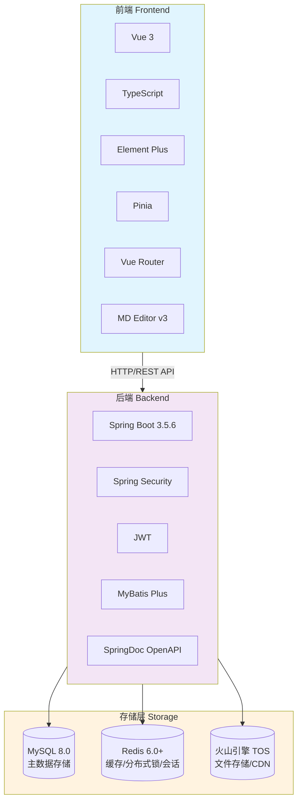
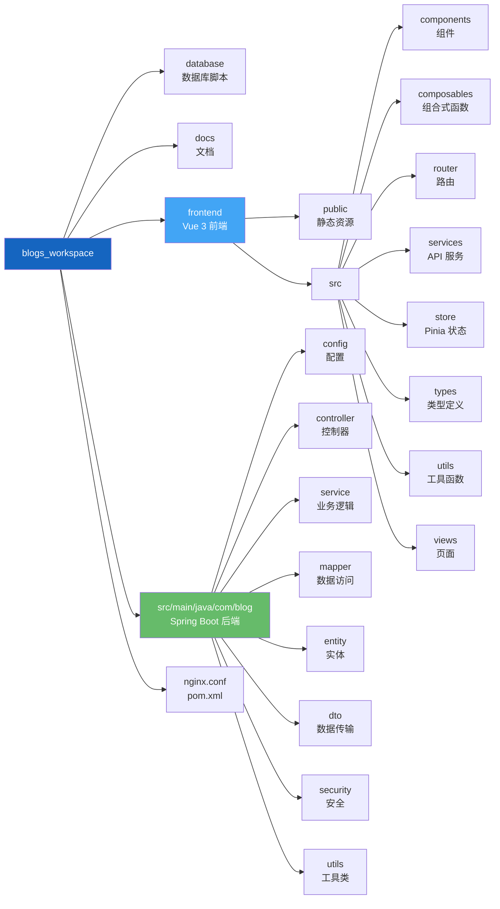

# Lumina - 代码与思考

<p align="center">
  
</p>

<p align="center">
  <b>一个现代化、高性能的全栈开源博客系统</b>
</p>

<p align="center">
  <a href="https://luminablog.cn" target="_blank">
    
  </a>
</p>

<p align="center">
  <a href="https://www.oracle.com/java/technologies/javase/jdk21-archive-downloads.html">
    
  </a>
  <a href="https://spring.io/projects/spring-boot">
    
  </a>
  <a href="https://vuejs.org/">
    
  </a>
  <a href="https://www.typescriptlang.org/">
    
  </a>
  <a href="https://vitejs.dev/">
    
  </a>
  <a href="https://redis.io/">
    
  </a>
  <a href="https://www.mysql.com/">
    
  </a>
  <a href="LICENSE">
    
  </a>
</p>

---

**Lumina** 是一个基于 **Spring Boot 3** + **Vue 3** 构建的开源全栈博客平台。项目采用前后端完全分离的现代化架构，融合了丰富的创作工具、精细的权限管理、高并发缓存策略与完善的社区互动体验，是学习 Java 全栈开发或搭建个人知识库的理想选择。

> **在线体验**: [https://luminablog.cn](https://luminablog.cn)
>
> **开源地址**: [https://github.com/4iKZ/blogs_workspace](https://github.com/4iKZ/blogs_workspace)

---

## 核心功能

### 创作与内容管理
| 功能 | 说明 |
|------|------|
| **全能 Markdown 编辑器** | 实时预览、代码高亮（Highlight.js）、数学公式（KaTeX）、流程图（Mermaid） |
| **文章全生命周期管理** | 支持草稿保存、发布、编辑、逻辑删除，封面图片上传 |
| **分类 & 标签体系** | 多层级分类管理，标签云展示，构建清晰知识体系 |
| **全站关键词搜索** | 高效检索系统，支持文章标题与内容的模糊匹配 |

### 社区互动体验
| 功能 | 说明 |
|------|------|
| **多级嵌套评论** | 支持楼中楼回复、评论点赞、多维度排序（最新/最热） |
| **文章点赞 & 收藏** | 基于 Redis 分布式锁保障高并发下的数据一致性 |
| **实时通知中心** | 评论提醒、点赞通知即时推送，支持已读/未读状态管理 |
| **用户主页** | 个人文章列表、点赞/收藏统计，支持查看他人主页 |

### 用户体验
| 功能 | 说明 |
|------|------|
| **深色/浅色主题** | 一键切换 Dark / Light 模式，内置视力友好配色方案 |
| **全端响应式布局** | 完美适配 PC、平板、手机等各种屏幕尺寸 |
| **图形验证码** | 注册/登录流程集成图形验证码，防止机器人注册 |
| **密码重置** | 支持通过邮箱验证进行安全密码重置 |

### 管理后台
| 功能 | 说明 |
|------|------|
| **数据统计大屏** | 可视化展示全站 PV/UV、用户增长趋势、文章热度排行 |
| **用户管理** | 查看、封禁、删除用户，角色权限管理（普通用户/管理员） |
| **文章 & 评论管理** | 全站内容审核、批量操作、逻辑删除 |
| **分类管理** | 创建、编辑、删除分类，查看各分类文章数量 |
| **系统动态配置** | 无需重启即可修改网站名称、描述、页脚等站点信息 |
| **数据备份** | 支持数据库备份与导出，保障数据安全 |

### 安全 & 性能
| 功能 | 说明 |
|------|------|
| **JWT 无状态认证** | Spring Security + JWT，支持分布式部署，Token 7天有效期 |
| **分布式锁防并发** | Redis 分布式锁保障点赞、计数等高频操作的原子性 |
| **敏感词过滤** | 内置敏感词过滤引擎，自动拦截违规评论内容 |
| **云端文件存储** | 集成火山引擎 TOS，支持图片/文件高速上传与 CDN 分发 |
| **事务同步缓存** | TransactionSynchronization 机制保障 DB 提交后缓存一致性 |

---

## 技术架构



### 技术栈一览

**后端**
- **框架**: Spring Boot 3.5.6 + Spring Security
- **持久层**: MyBatis Plus 3.5.5（逻辑删除、自动填充）
- **缓存**: Redis (Lettuce 连接池，最大 8 连接)
- **数据库**: MySQL 8.0+ (HikariCP，5~15 连接池)
- **认证**: JWT (io.jsonwebtoken 0.11.5)，Token 7 天有效期
- **工具**: Hutool 5.8.16 · Lombok 1.18.32 · Apache Commons
- **API 文档**: SpringDoc OpenAPI 2.5.0 (Swagger UI)
- **Java**: JDK 21 (虚拟线程友好)

**前端**
- **框架**: Vue 3.4 (Composition API) + TypeScript 5.2
- **构建**: Vite 5.2（极速 HMR）
- **UI**: Element Plus 2.7.6
- **状态**: Pinia 2.1.7
- **路由**: Vue Router 4.3.0
- **编辑器**: MD Editor v3（Markdown 全功能支持）
- **HTTP**: Axios（拦截器自动注入 JWT）

---

## 快速开始

### 环境要求

| 工具 | 版本要求 |
| :--- | :--- |
| **JDK** | 21+ |
| **Node.js** | 18.x+（推荐 20+） |
| **MySQL** | 8.0+ |
| **Redis** | 6.0+ |
| **Maven** | 3.8+ |

### 一、获取源码

```bash
git clone https://github.com/4iKZ/blogs_workspace.git
cd blogs_workspace
```

### 二、初始化数据库

```bash
# 建库、建表、建触发器
mysql -u root -p < database/schema.sql
# 插入示例数据（含默认管理员账号）
mysql -u root -p blog_db < database/data.sql
```

### 三、配置后端

编辑 `src/main/resources/application.yml`：

```yaml
spring:
  datasource:
    url: jdbc:mysql://localhost:3306/blog_db?useUnicode=true&characterEncoding=utf8&serverTimezone=Asia/Shanghai
    username: your_username
    password: your_password
  data:
    redis:
      host: localhost
      port: 6379
      password: your_redis_password  # 无密码时请删除整个 password 行
```

> 也可通过环境变量配置：`SPRING_DATASOURCE_URL`、`SPRING_DATASOURCE_USERNAME`、`SPRING_DATASOURCE_PASSWORD`、`JWT_SECRET`

### 四、启动后端

```bash
# Windows
mvnw.cmd spring-boot:run

# Linux / macOS
./mvnw spring-boot:run
```

后端启动后，API 文档地址：`http://localhost:8080/swagger-ui.html`

### 五、启动前端

```bash
cd frontend
npm install
npm run dev
```

前端默认运行在 `http://localhost:3000`，已配置代理将 `/api` 转发到后端 8080 端口。

### 六、登录体验

| 角色 | 账号 | 密码 |
|------|------|------|
| 管理员 | `admin` | `123456` |

---

## 项目结构



---

## 生产部署

推荐使用 **Nginx** 作为反向代理：

```nginx
# 前端静态文件（请将路径替换为实际的 frontend/dist 目录）
location / {
    root /path/to/frontend/dist;
    try_files $uri $uri/ /index.html;
}

# 后端 API 代理
location /api/ {
    proxy_pass http://localhost:8080;
    proxy_set_header Host $host;
    proxy_set_header X-Real-IP $remote_addr;
}
```

**打包命令：**
```bash
# 后端打包
mvn clean package -DskipTests
java -jar target/blog-backend-0.0.1-SNAPSHOT.jar

# 前端打包
cd frontend && npm run build
# 产物位于 frontend/dist/
```

> 生产环境请务必开启 HTTPS，并通过环境变量注入数据库密码、JWT Secret 以及火山引擎 TOS 的 Access Key / Secret Key，避免敏感凭证硬编码在配置文件中。

---

## 贡献指南

欢迎任何形式的贡献！Bug 修复、新功能、文档完善均可。

1. **Fork** 本仓库
2. 创建特性分支：`git checkout -b feature/your-feature-name`
3. 提交更改：`git commit -m 'feat: add some feature'`
4. 推送分支：`git push origin feature/your-feature-name`
5. 发起 **Pull Request**，描述你的改动

如发现 Bug 或有新功能建议，欢迎 [提交 Issue](https://github.com/4iKZ/blogs_workspace/issues)。

---

## 开源许可

本项目基于 [MIT License](LICENSE) 开源，您可以自由使用、修改和分发。

---

## 联系作者

| 方式 | 信息 |
|------|------|
| **作者** | 4iKZ |
| **邮箱** | syhaox@outlook.com |
| **GitHub** | [https://github.com/4iKZ](https://github.com/4iKZ) |
| **博客** | [https://luminablog.cn](https://luminablog.cn) |

---

<p align="center">
  <i>Lumina — 让代码发光，让思考留痕。</i>
  <br><br>
  如果这个项目对你有帮助，欢迎点个 ⭐ Star 支持！
</p>
