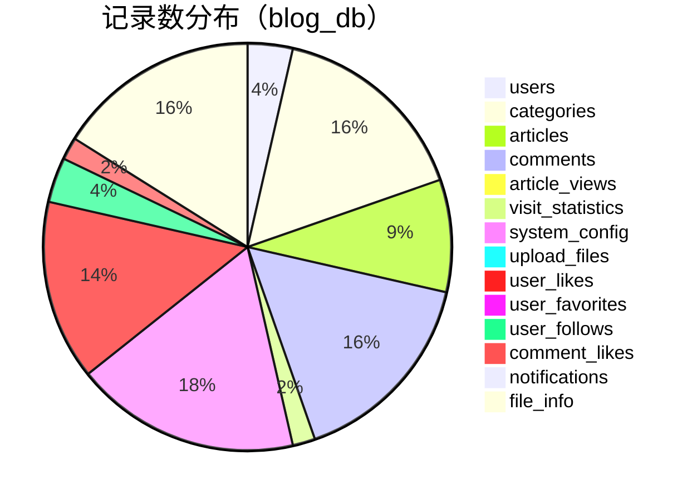
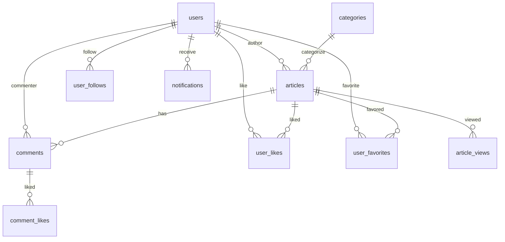

# 博客网站数据库设计文档

## 数据库概述

### 基本信息
- **数据库名称**: `blog_db`
- **字符集**: `utf8mb4`
- **排序规则**: `utf8mb4_unicode_ci`
- **存储引擎**: `InnoDB`

### 设计原则
1. 遵循第三范式，减少数据冗余
2. 合理使用索引，提升查询性能
3. 预留扩展字段，支持功能迭代
4. 统一命名规范，提高可维护性

---

## 数据表设计

### 1. 用户表 (users)
**功能**: 存储用户基本信息和账户状态

```sql
CREATE TABLE `users` (
  `id` bigint NOT NULL AUTO_INCREMENT COMMENT '用户ID',
  `username` varchar(50) NOT NULL COMMENT '用户名',
  `email` varchar(100) NOT NULL COMMENT '邮箱地址',
  `password` varchar(255) NOT NULL COMMENT '密码（BCrypt加密）',
  `nickname` varchar(50) DEFAULT NULL COMMENT '昵称',
  `avatar` varchar(500) DEFAULT NULL COMMENT '头像URL',
  `status` tinyint NOT NULL DEFAULT '1' COMMENT '状态：1-正常，2-禁用，3-删除',
  `role` tinyint NOT NULL DEFAULT '1' COMMENT '角色：1-普通用户，2-管理员，3-超级管理员',
  `last_login_time` datetime DEFAULT NULL COMMENT '最后登录时间',
  `last_login_ip` varchar(45) DEFAULT NULL COMMENT '最后登录IP',
  `create_time` datetime NOT NULL DEFAULT CURRENT_TIMESTAMP COMMENT '创建时间',
  `update_time` datetime NOT NULL DEFAULT CURRENT_TIMESTAMP ON UPDATE CURRENT_TIMESTAMP COMMENT '更新时间',
  PRIMARY KEY (`id`),
  UNIQUE KEY `uk_username` (`username`),
  UNIQUE KEY `uk_email` (`email`),
  KEY `idx_status` (`status`),
  KEY `idx_create_time` (`create_time`)
) ENGINE=InnoDB DEFAULT CHARSET=utf8mb4 COLLATE=utf8mb4_unicode_ci COMMENT='用户表';
```

### 2. 分类表 (categories)
**功能**: 存储文章分类信息，支持层级结构

```sql
CREATE TABLE `categories` (
  `id` bigint NOT NULL AUTO_INCREMENT COMMENT '分类ID',
  `name` varchar(50) NOT NULL COMMENT '分类名称',
  `description` varchar(200) DEFAULT NULL COMMENT '分类描述',
  `parent_id` bigint NOT NULL DEFAULT '0' COMMENT '父分类ID，0表示顶级分类',
  `sort_order` int NOT NULL DEFAULT '0' COMMENT '排序序号',
  `article_count` int NOT NULL DEFAULT '0' COMMENT '文章数量',
  `status` tinyint NOT NULL DEFAULT '1' COMMENT '状态：1-正常，2-禁用',
  `create_time` datetime NOT NULL DEFAULT CURRENT_TIMESTAMP COMMENT '创建时间',
  `update_time` datetime NOT NULL DEFAULT CURRENT_TIMESTAMP ON UPDATE CURRENT_TIMESTAMP COMMENT '更新时间',
  PRIMARY KEY (`id`),
  UNIQUE KEY `uk_name_parent` (`name`, `parent_id`),
  KEY `idx_parent_id` (`parent_id`),
  KEY `idx_sort_order` (`sort_order`)
) ENGINE=InnoDB DEFAULT CHARSET=utf8mb4 COLLATE=utf8mb4_unicode_ci COMMENT='分类表';
```

<!-- 已移除未实现：标签表（tags） -->

### 4. 文章表 (articles)
**功能**: 存储文章内容和元数据

```sql
CREATE TABLE `articles` (
  `id` bigint NOT NULL AUTO_INCREMENT COMMENT '文章ID',
  `title` varchar(200) NOT NULL COMMENT '文章标题',
  `content` longtext NOT NULL COMMENT '文章内容（Markdown格式）',
  `summary` varchar(500) DEFAULT NULL COMMENT '文章摘要',
  `cover_image` varchar(500) DEFAULT NULL COMMENT '封面图片URL',
  `category_id` bigint NOT NULL COMMENT '分类ID',
  `author_id` bigint NOT NULL COMMENT '作者ID',
  `status` tinyint NOT NULL DEFAULT '1' COMMENT '状态：1-草稿，2-已发布，3-已删除',
  `view_count` int NOT NULL DEFAULT '0' COMMENT '浏览量',
  `like_count` int NOT NULL DEFAULT '0' COMMENT '点赞数',
  `comment_count` int NOT NULL DEFAULT '0' COMMENT '评论数',
  `favorite_count` int NOT NULL DEFAULT '0' COMMENT '收藏数',
  `is_top` tinyint NOT NULL DEFAULT '0' COMMENT '是否置顶：0-否，1-是',
  `is_recommend` tinyint NOT NULL DEFAULT '0' COMMENT '是否推荐：0-否，1-是',
  `publish_time` datetime DEFAULT NULL COMMENT '发布时间',
  `create_time` datetime NOT NULL DEFAULT CURRENT_TIMESTAMP COMMENT '创建时间',
  `update_time` datetime NOT NULL DEFAULT CURRENT_TIMESTAMP ON UPDATE CURRENT_TIMESTAMP COMMENT '更新时间',
  PRIMARY KEY (`id`),
  KEY `idx_category_id` (`category_id`),
  KEY `idx_author_id` (`author_id`),
  KEY `idx_status` (`status`),
  KEY `idx_publish_time` (`publish_time`),
  KEY `idx_view_count` (`view_count`),
  KEY `idx_like_count` (`like_count`),
  KEY `idx_is_top_recommend` (`is_top`, `is_recommend`),
  FULLTEXT KEY `ft_title_content` (`title`, `content`),
  CONSTRAINT `fk_articles_category` FOREIGN KEY (`category_id`) REFERENCES `categories` (`id`),
  CONSTRAINT `fk_articles_author` FOREIGN KEY (`author_id`) REFERENCES `users` (`id`)
) ENGINE=InnoDB DEFAULT CHARSET=utf8mb4 COLLATE=utf8mb4_unicode_ci COMMENT='文章表';
```

<!-- 已移除未实现：文章标签关联表（article_tags） -->

### 6. 评论表 (comments)
**功能**: 存储文章评论，支持层级回复

```sql
CREATE TABLE `comments` (
  `id` bigint NOT NULL AUTO_INCREMENT COMMENT '评论ID',
  `article_id` bigint NOT NULL COMMENT '文章ID',
  `user_id` bigint NOT NULL COMMENT '用户ID',
  `parent_id` bigint NOT NULL DEFAULT '0' COMMENT '父评论ID，0表示顶级评论',
  `content` text NOT NULL COMMENT '评论内容',
  `like_count` int NOT NULL DEFAULT '0' COMMENT '点赞数',
  `status` tinyint NOT NULL DEFAULT '1' COMMENT '状态：1-待审核，2-已通过，3-已拒绝，4-已删除',
  `ip_address` varchar(45) DEFAULT NULL COMMENT 'IP地址',
  `user_agent` varchar(500) DEFAULT NULL COMMENT '用户代理',
  `create_time` datetime NOT NULL DEFAULT CURRENT_TIMESTAMP COMMENT '创建时间',
  `update_time` datetime NOT NULL DEFAULT CURRENT_TIMESTAMP ON UPDATE CURRENT_TIMESTAMP COMMENT '更新时间',
  PRIMARY KEY (`id`),
  KEY `idx_article_id` (`article_id`),
  KEY `idx_user_id` (`user_id`),
  KEY `idx_parent_id` (`parent_id`),
  KEY `idx_status` (`status`),
  KEY `idx_create_time` (`create_time`),
  CONSTRAINT `fk_comments_article` FOREIGN KEY (`article_id`) REFERENCES `articles` (`id`) ON DELETE CASCADE,
  CONSTRAINT `fk_comments_user` FOREIGN KEY (`user_id`) REFERENCES `users` (`id`)
) ENGINE=InnoDB DEFAULT CHARSET=utf8mb4 COLLATE=utf8mb4_unicode_ci COMMENT='评论表';
```

### 7. 用户收藏表 (user_favorites)
**功能**: 存储用户收藏的文章

```sql
CREATE TABLE `user_favorites` (
  `id` bigint NOT NULL AUTO_INCREMENT COMMENT '收藏ID',
  `user_id` bigint NOT NULL COMMENT '用户ID',
  `article_id` bigint NOT NULL COMMENT '文章ID',
  `create_time` datetime NOT NULL DEFAULT CURRENT_TIMESTAMP COMMENT '收藏时间',
  PRIMARY KEY (`id`),
  UNIQUE KEY `uk_user_article` (`user_id`, `article_id`),
  KEY `idx_article_id` (`article_id`),
  KEY `idx_create_time` (`create_time`),
  CONSTRAINT `fk_favorites_user` FOREIGN KEY (`user_id`) REFERENCES `users` (`id`) ON DELETE CASCADE,
  CONSTRAINT `fk_favorites_article` FOREIGN KEY (`article_id`) REFERENCES `articles` (`id`) ON DELETE CASCADE
) ENGINE=InnoDB DEFAULT CHARSET=utf8mb4 COLLATE=utf8mb4_unicode_ci COMMENT='用户收藏表';
```

### 8. 用户点赞表 (user_likes)
**功能**: 存储用户点赞记录（文章和评论）

```sql
CREATE TABLE `user_likes` (
  `id` bigint NOT NULL AUTO_INCREMENT COMMENT '点赞ID',
  `user_id` bigint NOT NULL COMMENT '用户ID',
  `target_id` bigint NOT NULL COMMENT '目标ID（文章ID或评论ID）',
  `target_type` tinyint NOT NULL COMMENT '目标类型：1-文章，2-评论',
  `create_time` datetime NOT NULL DEFAULT CURRENT_TIMESTAMP COMMENT '点赞时间',
  PRIMARY KEY (`id`),
  UNIQUE KEY `uk_user_target` (`user_id`, `target_id`, `target_type`),
  KEY `idx_target` (`target_id`, `target_type`),
  KEY `idx_create_time` (`create_time`),
  CONSTRAINT `fk_likes_user` FOREIGN KEY (`user_id`) REFERENCES `users` (`id`) ON DELETE CASCADE
) ENGINE=InnoDB DEFAULT CHARSET=utf8mb4 COLLATE=utf8mb4_unicode_ci COMMENT='用户点赞表';
```

### 9. 文件上传记录表 (upload_files)
**功能**: 存储文件上传记录和管理

```sql
CREATE TABLE `upload_files` (
  `id` bigint NOT NULL AUTO_INCREMENT COMMENT '文件ID',
  `original_name` varchar(255) NOT NULL COMMENT '原始文件名',
  `file_name` varchar(255) NOT NULL COMMENT '存储文件名',
  `file_path` varchar(500) NOT NULL COMMENT '文件路径',
  `file_url` varchar(500) NOT NULL COMMENT '访问URL',
  `file_size` bigint NOT NULL COMMENT '文件大小（字节）',
  `file_type` varchar(50) NOT NULL COMMENT '文件类型',
  `mime_type` varchar(100) NOT NULL COMMENT 'MIME类型',
  `upload_user_id` bigint NOT NULL COMMENT '上传用户ID',
  `usage_type` tinyint NOT NULL DEFAULT '1' COMMENT '用途类型：1-文章图片，2-头像，3-其他',
  `status` tinyint NOT NULL DEFAULT '1' COMMENT '状态：1-正常，2-已删除',
  `create_time` datetime NOT NULL DEFAULT CURRENT_TIMESTAMP COMMENT '上传时间',
  `update_time` datetime NOT NULL DEFAULT CURRENT_TIMESTAMP ON UPDATE CURRENT_TIMESTAMP COMMENT '更新时间',
  PRIMARY KEY (`id`),
  UNIQUE KEY `uk_file_path` (`file_path`),
  KEY `idx_upload_user_id` (`upload_user_id`),
  KEY `idx_usage_type` (`usage_type`),
  KEY `idx_status` (`status`),
  KEY `idx_create_time` (`create_time`),
  CONSTRAINT `fk_upload_files_user` FOREIGN KEY (`upload_user_id`) REFERENCES `users` (`id`)
) ENGINE=InnoDB DEFAULT CHARSET=utf8mb4 COLLATE=utf8mb4_unicode_ci COMMENT='文件上传记录表';
```

### 10. 访问统计表 (visit_statistics)
**功能**: 存储网站访问统计数据

```sql
CREATE TABLE `visit_statistics` (
  `id` bigint NOT NULL AUTO_INCREMENT COMMENT '统计ID',
  `date` date NOT NULL COMMENT '统计日期',
  `total_visits` int NOT NULL DEFAULT '0' COMMENT '总访问量',
  `unique_visitors` int NOT NULL DEFAULT '0' COMMENT '独立访客数',
  `page_views` int NOT NULL DEFAULT '0' COMMENT '页面浏览量',
  `new_users` int NOT NULL DEFAULT '0' COMMENT '新用户数',
  `new_articles` int NOT NULL DEFAULT '0' COMMENT '新文章数',
  `new_comments` int NOT NULL DEFAULT '0' COMMENT '新评论数',
  `create_time` datetime NOT NULL DEFAULT CURRENT_TIMESTAMP COMMENT '创建时间',
  `update_time` datetime NOT NULL DEFAULT CURRENT_TIMESTAMP ON UPDATE CURRENT_TIMESTAMP COMMENT '更新时间',
  PRIMARY KEY (`id`),
  UNIQUE KEY `uk_date` (`date`),
  KEY `idx_create_time` (`create_time`)
) ENGINE=InnoDB DEFAULT CHARSET=utf8mb4 COLLATE=utf8mb4_unicode_ci COMMENT='访问统计表';
```

### 11. 文章浏览记录表 (article_views)
**功能**: 记录文章浏览详情，用于统计分析

```sql
CREATE TABLE `article_views` (
  `id` bigint NOT NULL AUTO_INCREMENT COMMENT '浏览记录ID',
  `article_id` bigint NOT NULL COMMENT '文章ID',
  `user_id` bigint DEFAULT NULL COMMENT '用户ID（游客为NULL）',
  `ip_address` varchar(45) NOT NULL COMMENT 'IP地址',
  `user_agent` varchar(500) DEFAULT NULL COMMENT '用户代理',
  `referer` varchar(500) DEFAULT NULL COMMENT '来源页面',
  `view_date` date NOT NULL COMMENT '浏览日期',
  `view_time` datetime NOT NULL DEFAULT CURRENT_TIMESTAMP COMMENT '浏览时间',
  PRIMARY KEY (`id`),
  KEY `idx_article_id` (`article_id`),
  KEY `idx_user_id` (`user_id`),
  KEY `idx_view_date` (`view_date`),
  KEY `idx_view_time` (`view_time`),
  KEY `idx_ip_article_date` (`ip_address`, `article_id`, `view_date`),
  CONSTRAINT `fk_article_views_article` FOREIGN KEY (`article_id`) REFERENCES `articles` (`id`) ON DELETE CASCADE,
  CONSTRAINT `fk_article_views_user` FOREIGN KEY (`user_id`) REFERENCES `users` (`id`) ON DELETE SET NULL
) ENGINE=InnoDB DEFAULT CHARSET=utf8mb4 COLLATE=utf8mb4_unicode_ci COMMENT='文章浏览记录表';
```

### 12. 系统配置表 (system_config)
**功能**: 存储系统配置信息

```sql
CREATE TABLE `system_config` (
  `id` bigint NOT NULL AUTO_INCREMENT COMMENT '配置ID',
  `config_key` varchar(100) NOT NULL COMMENT '配置键',
  `config_value` text COMMENT '配置值',
  `config_type` varchar(20) NOT NULL DEFAULT 'string' COMMENT '配置类型：string/number/boolean/json',
  `description` varchar(200) DEFAULT NULL COMMENT '配置描述',
  `is_public` tinyint NOT NULL DEFAULT '0' COMMENT '是否公开：0-否，1-是',
  `create_time` datetime NOT NULL DEFAULT CURRENT_TIMESTAMP COMMENT '创建时间',
  `update_time` datetime NOT NULL DEFAULT CURRENT_TIMESTAMP ON UPDATE CURRENT_TIMESTAMP COMMENT '更新时间',
  PRIMARY KEY (`id`),
  UNIQUE KEY `uk_config_key` (`config_key`)
) ENGINE=InnoDB DEFAULT CHARSET=utf8mb4 COLLATE=utf8mb4_unicode_ci COMMENT='系统配置表';
```

---

## 索引设计说明

### 主要索引策略
1. **主键索引**: 所有表都有自增主键
2. **唯一索引**: 防止数据重复（用户名、邮箱等）
3. **外键索引**: 提升关联查询性能
4. **复合索引**: 针对常用查询条件组合
5. **全文索引**: 支持文章内容搜索

### 性能优化考虑
1. **分页查询优化**: 创建时间索引支持时间排序
2. **统计查询优化**: 计数字段索引支持排行榜
3. **搜索优化**: 全文索引支持内容搜索
4. **去重优化**: 唯一索引防止重复操作

---

## 数据完整性约束

### 外键约束
- 文章必须属于有效的分类和作者
- 评论必须关联有效的文章和用户
- 收藏和点赞必须关联有效的用户和目标

### 级联操作
- 删除文章时自动删除相关评论、收藏、点赞
- 删除用户时保留文章但清空个人数据
- 删除分类/标签时需要先处理关联文章

### 数据验证
- 状态字段使用枚举值限制
- 邮箱格式在应用层验证
- 文件大小和类型在应用层限制

---

## 扩展性设计

### 预留字段
- 各表预留扩展字段用于功能迭代
- 状态字段支持新增状态类型
- 配置表支持动态配置管理

### 分表分库准备
- 使用bigint主键支持大数据量
- 时间字段支持按时间分表
- 用户ID支持按用户分库

### 缓存友好
- 设计支持Redis缓存
- 计数字段支持缓存同步
- 热点数据查询优化

这个数据库设计完全支持API接口文档中的所有功能需求，包括用户管理、文章管理、评论系统、收藏点赞、文件上传、统计分析和管理后台等模块。
---

## 数据库查询与分析报告（2025-12-09）

### 数据库运行环境
- **MySQL 版本**: `8.0.44-0ubuntu0.24.04.1`
- **连接模板**: `mysql -u root -proot -h 127.0.0.1 -e "show databases;"`
- **目标库**: `blog_db`

### 实际库表结构（SHOW CREATE TABLE）

#### users
```sql
SHOW CREATE TABLE users\G;
```
```sql
CREATE TABLE `users` (
  `id` bigint NOT NULL AUTO_INCREMENT COMMENT '用户ID',
  `username` varchar(50) COLLATE utf8mb4_unicode_ci NOT NULL COMMENT '用户名',
  `email` varchar(100) COLLATE utf8mb4_unicode_ci NOT NULL COMMENT '邮箱地址',
  `password` varchar(255) COLLATE utf8mb4_unicode_ci NOT NULL COMMENT '密码（BCrypt加密）',
  `nickname` varchar(50) COLLATE utf8mb4_unicode_ci DEFAULT NULL COMMENT '昵称',
  `avatar` varchar(500) COLLATE utf8mb4_unicode_ci DEFAULT NULL COMMENT '头像URL',
  `status` tinyint NOT NULL DEFAULT '1' COMMENT '状态：1-正常，2-禁用，3-删除',
  `role` tinyint NOT NULL DEFAULT '1' COMMENT '角色：1-普通用户，2-管理员，3-超级管理员',
  `last_login_time` datetime DEFAULT NULL COMMENT '最后登录时间',
  `last_login_ip` varchar(45) COLLATE utf8mb4_unicode_ci DEFAULT NULL COMMENT '最后登录IP',
  `create_time` datetime NOT NULL DEFAULT CURRENT_TIMESTAMP COMMENT '创建时间',
  `update_time` datetime NOT NULL DEFAULT CURRENT_TIMESTAMP ON UPDATE CURRENT_TIMESTAMP COMMENT '更新时间',
  `phone` varchar(20) COLLATE utf8mb4_unicode_ci DEFAULT NULL,
  `bio` varchar(255) COLLATE utf8mb4_unicode_ci DEFAULT NULL,
  `website` varchar(255) COLLATE utf8mb4_unicode_ci DEFAULT NULL,
  `follower_count` int NOT NULL DEFAULT '0' COMMENT '粉丝数量',
  `following_count` int NOT NULL DEFAULT '0' COMMENT '关注数量',
  PRIMARY KEY (`id`),
  UNIQUE KEY `uk_username` (`username`),
  UNIQUE KEY `uk_email` (`email`),
  KEY `idx_status` (`status`),
  KEY `idx_create_time` (`create_time`)
) ENGINE=InnoDB DEFAULT CHARSET=utf8mb4 COLLATE=utf8mb4_unicode_ci COMMENT='用户表';
```

#### categories
```sql
SHOW CREATE TABLE categories\G;
```
```sql
CREATE TABLE `categories` (
  `id` bigint NOT NULL AUTO_INCREMENT COMMENT '分类ID',
  `name` varchar(50) COLLATE utf8mb4_unicode_ci NOT NULL COMMENT '分类名称',
  `description` varchar(200) COLLATE utf8mb4_unicode_ci DEFAULT NULL COMMENT '分类描述',
  `parent_id` bigint NOT NULL DEFAULT '0' COMMENT '父分类ID，0表示顶级分类',
  `sort_order` int NOT NULL DEFAULT '0' COMMENT '排序序号',
  `article_count` int NOT NULL DEFAULT '0' COMMENT '文章数量',
  `status` tinyint NOT NULL DEFAULT '1' COMMENT '状态：1-正常，2-禁用',
  `create_time` datetime NOT NULL DEFAULT CURRENT_TIMESTAMP COMMENT '创建时间',
  `update_time` datetime NOT NULL DEFAULT CURRENT_TIMESTAMP ON UPDATE CURRENT_TIMESTAMP COMMENT '更新时间',
  PRIMARY KEY (`id`),
  UNIQUE KEY `uk_name_parent` (`name`,`parent_id`),
  KEY `idx_parent_id` (`parent_id`),
  KEY `idx_sort_order` (`sort_order`)
) ENGINE=InnoDB DEFAULT CHARSET=utf8mb4 COLLATE=utf8mb4_unicode_ci COMMENT='分类表';
```

#### articles
```sql
SHOW CREATE TABLE articles\G;
```
```sql
CREATE TABLE `articles` (
  `id` bigint NOT NULL AUTO_INCREMENT COMMENT '文章ID',
  `title` varchar(200) COLLATE utf8mb4_unicode_ci NOT NULL COMMENT '文章标题',
  `content` longtext COLLATE utf8mb4_unicode_ci NOT NULL COMMENT '文章内容（Markdown格式）',
  `summary` varchar(500) COLLATE utf8mb4_unicode_ci DEFAULT NULL COMMENT '文章摘要',
  `cover_image` varchar(500) COLLATE utf8mb4_unicode_ci DEFAULT NULL COMMENT '封面图片URL',
  `category_id` bigint NOT NULL COMMENT '分类ID',
  `author_id` bigint NOT NULL COMMENT '作者ID',
  `status` tinyint NOT NULL DEFAULT '1' COMMENT '状态：1-草稿，2-已发布，3-已删除',
  `view_count` int NOT NULL DEFAULT '0' COMMENT '浏览量',
  `like_count` int NOT NULL DEFAULT '0' COMMENT '点赞数',
  `comment_count` int NOT NULL DEFAULT '0' COMMENT '评论数',
  `favorite_count` int NOT NULL DEFAULT '0' COMMENT '收藏数',
  `is_top` tinyint NOT NULL DEFAULT '0' COMMENT '是否置顶：0-否，1-是',
  `is_recommend` tinyint NOT NULL DEFAULT '0' COMMENT '是否推荐：0-否，1-是',
  `publish_time` datetime DEFAULT NULL COMMENT '发布时间',
  `create_time` datetime NOT NULL DEFAULT CURRENT_TIMESTAMP COMMENT '创建时间',
  `update_time` datetime NOT NULL DEFAULT CURRENT_TIMESTAMP ON UPDATE CURRENT_TIMESTAMP COMMENT '更新时间',
  `topic_id` bigint DEFAULT NULL COMMENT '话题ID',
  PRIMARY KEY (`id`),
  KEY `idx_category_id` (`category_id`),
  KEY `idx_author_id` (`author_id`),
  KEY `idx_status` (`status`),
  KEY `idx_publish_time` (`publish_time`),
  KEY `idx_view_count` (`view_count`),
  KEY `idx_like_count` (`like_count`),
  KEY `idx_is_top_recommend` (`is_top`,`is_recommend`),
  FULLTEXT KEY `ft_title_content` (`title`,`content`),
  CONSTRAINT `fk_articles_author` FOREIGN KEY (`author_id`) REFERENCES `users` (`id`),
  CONSTRAINT `fk_articles_category` FOREIGN KEY (`category_id`) REFERENCES `categories` (`id`)
) ENGINE=InnoDB DEFAULT CHARSET=utf8mb4 COLLATE=utf8mb4_unicode_ci COMMENT='文章表';
```

#### comments
```sql
SHOW CREATE TABLE comments\G;
```
```sql
CREATE TABLE `comments` (
  `id` bigint NOT NULL AUTO_INCREMENT COMMENT '评论ID',
  `article_id` bigint NOT NULL COMMENT '文章ID',
  `user_id` bigint NOT NULL COMMENT '用户ID',
  `parent_id` bigint NOT NULL DEFAULT '0' COMMENT '父评论ID，0表示顶级评论',
  `content` text COLLATE utf8mb4_unicode_ci NOT NULL COMMENT '评论内容',
  `like_count` int NOT NULL DEFAULT '0' COMMENT '点赞数',
  `status` tinyint NOT NULL DEFAULT '1' COMMENT '状态：1-待审核，2-已通过，3-已拒绝，4-已删除',
  `ip_address` varchar(45) COLLATE utf8mb4_unicode_ci DEFAULT NULL COMMENT 'IP地址',
  `user_agent` varchar(500) COLLATE utf8mb4_unicode_ci DEFAULT NULL COMMENT '用户代理',
  `create_time` datetime NOT NULL DEFAULT CURRENT_TIMESTAMP COMMENT '创建时间',
  `update_time` datetime NOT NULL DEFAULT CURRENT_TIMESTAMP ON UPDATE CURRENT_TIMESTAMP COMMENT '更新时间',
  `deleted` tinyint NOT NULL DEFAULT '0' COMMENT '逻辑删除：0-未删除，1-已删除',
  PRIMARY KEY (`id`),
  KEY `idx_article_id` (`article_id`),
  KEY `idx_user_id` (`user_id`),
  KEY `idx_parent_id` (`parent_id`),
  KEY `idx_status` (`status`),
  KEY `idx_create_time` (`create_time`),
  CONSTRAINT `fk_comments_article` FOREIGN KEY (`article_id`) REFERENCES `articles` (`id`) ON DELETE CASCADE,
  CONSTRAINT `fk_comments_user` FOREIGN KEY (`user_id`) REFERENCES `users` (`id`)
) ENGINE=InnoDB DEFAULT CHARSET=utf8mb4 COLLATE=utf8mb4_unicode_ci COMMENT='评论表';
```

#### article_views
```sql
SHOW CREATE TABLE article_views\G;
```
```sql
CREATE TABLE `article_views` (
  `id` bigint NOT NULL AUTO_INCREMENT COMMENT '浏览记录ID',
  `article_id` bigint NOT NULL COMMENT '文章ID',
  `user_id` bigint DEFAULT NULL COMMENT '用户ID（游客为NULL）',
  `ip_address` varchar(45) COLLATE utf8mb4_unicode_ci NOT NULL COMMENT 'IP地址',
  `user_agent` varchar(500) COLLATE utf8mb4_unicode_ci DEFAULT NULL COMMENT '用户代理',
  `referer` varchar(500) COLLATE utf8mb4_unicode_ci DEFAULT NULL COMMENT '来源页面',
  `view_date` date NOT NULL COMMENT '浏览日期',
  `view_time` datetime NOT NULL DEFAULT CURRENT_TIMESTAMP COMMENT '浏览时间',
  PRIMARY KEY (`id`),
  KEY `idx_article_id` (`article_id`),
  KEY `idx_user_id` (`user_id`),
  KEY `idx_view_date` (`view_date`),
  KEY `idx_view_time` (`view_time`),
  KEY `idx_ip_article_date` (`ip_address`,`article_id`,`view_date`),
  CONSTRAINT `fk_article_views_article` FOREIGN KEY (`article_id`) REFERENCES `articles` (`id`) ON DELETE CASCADE,
  CONSTRAINT `fk_article_views_user` FOREIGN KEY (`user_id`) REFERENCES `users` (`id`) ON DELETE SET NULL
) ENGINE=InnoDB DEFAULT CHARSET=utf8mb4 COLLATE=utf8mb4_unicode_ci COMMENT='文章浏览记录表';
```

#### visit_statistics
```sql
SHOW CREATE TABLE visit_statistics\G;
```
```sql
CREATE TABLE `visit_statistics` (
  `id` bigint NOT NULL AUTO_INCREMENT COMMENT '统计ID',
  `date` date NOT NULL COMMENT '统计日期',
  `total_visits` int NOT NULL DEFAULT '0' COMMENT '总访问量',
  `unique_visitors` int NOT NULL DEFAULT '0' COMMENT '独立访客数',
  `page_views` int NOT NULL DEFAULT '0' COMMENT '页面浏览量',
  `new_users` int NOT NULL DEFAULT '0' COMMENT '新用户数',
  `new_articles` int NOT NULL DEFAULT '0' COMMENT '新文章数',
  `new_comments` int NOT NULL DEFAULT '0' COMMENT '新评论数',
  `create_time` datetime NOT NULL DEFAULT CURRENT_TIMESTAMP COMMENT '创建时间',
  `update_time` datetime NOT NULL DEFAULT CURRENT_TIMESTAMP ON UPDATE CURRENT_TIMESTAMP COMMENT '更新时间',
  PRIMARY KEY (`id`),
  UNIQUE KEY `uk_date` (`date`),
  KEY `idx_create_time` (`create_time`)
) ENGINE=InnoDB DEFAULT CHARSET=utf8mb4 COLLATE=utf8mb4_unicode_ci COMMENT='访问统计表';
```

#### system_config
```sql
SHOW CREATE TABLE system_config\G;
```
```sql
CREATE TABLE `system_config` (
  `id` bigint NOT NULL AUTO_INCREMENT COMMENT '配置ID',
  `config_key` varchar(100) COLLATE utf8mb4_unicode_ci NOT NULL COMMENT '配置键',
  `config_value` text COLLATE utf8mb4_unicode_ci COMMENT '配置值',
  `config_type` varchar(20) COLLATE utf8mb4_unicode_ci NOT NULL DEFAULT 'string' COMMENT '配置类型：string/number/boolean/json',
  `description` varchar(200) COLLATE utf8mb4_unicode_ci DEFAULT NULL COMMENT '配置描述',
  `is_public` tinyint NOT NULL DEFAULT '0' COMMENT '是否公开：0-否，1-是',
  `create_time` datetime NOT NULL DEFAULT CURRENT_TIMESTAMP COMMENT '创建时间',
  `update_time` datetime NOT NULL DEFAULT CURRENT_TIMESTAMP ON UPDATE CURRENT_TIMESTAMP COMMENT '更新时间',
  PRIMARY KEY (`id`),
  UNIQUE KEY `uk_config_key` (`config_key`)
) ENGINE=InnoDB DEFAULT CHARSET=utf8mb4 COLLATE=utf8mb4_unicode_ci COMMENT='系统配置表';
```

#### upload_files
```sql
SHOW CREATE TABLE upload_files\G;
```
```sql
CREATE TABLE `upload_files` (
  `id` bigint NOT NULL AUTO_INCREMENT COMMENT '文件ID',
  `original_name` varchar(255) COLLATE utf8mb4_unicode_ci NOT NULL COMMENT '原始文件名',
  `file_name` varchar(255) COLLATE utf8mb4_unicode_ci NOT NULL COMMENT '存储文件名',
  `file_path` varchar(500) COLLATE utf8mb4_unicode_ci NOT NULL COMMENT '文件路径',
  `file_url` varchar(500) COLLATE utf8mb4_unicode_ci NOT NULL COMMENT '访问URL',
  `file_size` bigint NOT NULL COMMENT '文件大小（字节）',
  `file_type` varchar(50) COLLATE utf8mb4_unicode_ci NOT NULL COMMENT '文件类型',
  `mime_type` varchar(100) COLLATE utf8mb4_unicode_ci NOT NULL COMMENT 'MIME类型',
  `upload_user_id` bigint NOT NULL COMMENT '上传用户ID',
  `usage_type` tinyint NOT NULL DEFAULT '1' COMMENT '用途类型：1-文章图片，2-头像，3-其他',
  `status` tinyint NOT NULL DEFAULT '1' COMMENT '状态：1-正常，2-已删除',
  `create_time` datetime NOT NULL DEFAULT CURRENT_TIMESTAMP COMMENT '上传时间',
  `update_time` datetime NOT NULL DEFAULT CURRENT_TIMESTAMP ON UPDATE CURRENT_TIMESTAMP COMMENT '更新时间',
  PRIMARY KEY (`id`),
  UNIQUE KEY `uk_file_path` (`file_path`),
  KEY `idx_upload_user_id` (`upload_user_id`),
  KEY `idx_usage_type` (`usage_type`),
  KEY `idx_status` (`status`),
  KEY `idx_create_time` (`create_time`),
  CONSTRAINT `fk_upload_files_user` FOREIGN KEY (`upload_user_id`) REFERENCES `users` (`id`)
) ENGINE=InnoDB DEFAULT CHARSET=utf8mb4 COLLATE=utf8mb4_unicode_ci COMMENT='文件上传记录表';
```

#### user_likes
```sql
SHOW CREATE TABLE user_likes\G;
```
```sql
CREATE TABLE `user_likes` (
  `id` bigint NOT NULL AUTO_INCREMENT COMMENT '点赞ID',
  `user_id` bigint NOT NULL COMMENT '用户ID',
  `target_id` bigint NOT NULL COMMENT '目标ID（文章ID或评论ID）',
  `target_type` tinyint NOT NULL COMMENT '目标类型：1-文章，2-评论',
  `create_time` datetime NOT NULL DEFAULT CURRENT_TIMESTAMP COMMENT '点赞时间',
  PRIMARY KEY (`id`),
  UNIQUE KEY `uk_user_target` (`user_id`,`target_id`,`target_type`),
  KEY `idx_target` (`target_id`,`target_type`),
  KEY `idx_create_time` (`create_time`),
  CONSTRAINT `fk_likes_user` FOREIGN KEY (`user_id`) REFERENCES `users` (`id`) ON DELETE CASCADE
) ENGINE=InnoDB DEFAULT CHARSET=utf8mb4 COLLATE=utf8mb4_unicode_ci COMMENT='用户点赞表';
```

#### user_favorites
```sql
SHOW CREATE TABLE user_favorites\G;
```
```sql
CREATE TABLE `user_favorites` (
  `id` bigint NOT NULL AUTO_INCREMENT COMMENT '收藏ID',
  `user_id` bigint NOT NULL COMMENT '用户ID',
  `article_id` bigint NOT NULL COMMENT '文章ID',
  `create_time` datetime NOT NULL DEFAULT CURRENT_TIMESTAMP COMMENT '收藏时间',
  PRIMARY KEY (`id`),
  UNIQUE KEY `uk_user_article` (`user_id`,`article_id`),
  KEY `idx_article_id` (`article_id`),
  KEY `idx_create_time` (`create_time`),
  CONSTRAINT `fk_favorites_article` FOREIGN KEY (`article_id`) REFERENCES `articles` (`id`) ON DELETE CASCADE,
  CONSTRAINT `fk_favorites_user` FOREIGN KEY (`user_id`) REFERENCES `users` (`id`) ON DELETE CASCADE
) ENGINE=InnoDB DEFAULT CHARSET=utf8mb4 COLLATE=utf8mb4_unicode_ci COMMENT='用户收藏表';
```

#### user_follows
```sql
SHOW CREATE TABLE user_follows\G;
```
```sql
CREATE TABLE `user_follows` (
  `id` bigint NOT NULL AUTO_INCREMENT,
  `follower_id` bigint NOT NULL COMMENT '关注者ID',
  `following_id` bigint NOT NULL COMMENT '被关注者ID',
  `create_time` datetime NOT NULL DEFAULT CURRENT_TIMESTAMP COMMENT '关注时间',
  `update_time` datetime NOT NULL DEFAULT CURRENT_TIMESTAMP ON UPDATE CURRENT_TIMESTAMP,
  `deleted` tinyint NOT NULL DEFAULT '0' COMMENT '逻辑删除标志：0-未删除，1-已删除',
  PRIMARY KEY (`id`),
  UNIQUE KEY `uk_follower_following` (`follower_id`,`following_id`),
  KEY `idx_follower` (`follower_id`),
  KEY `idx_following` (`following_id`),
  CONSTRAINT `fk_follower` FOREIGN KEY (`follower_id`) REFERENCES `users` (`id`) ON DELETE CASCADE,
  CONSTRAINT `fk_following` FOREIGN KEY (`following_id`) REFERENCES `users` (`id`) ON DELETE CASCADE
) ENGINE=InnoDB DEFAULT CHARSET=utf8mb4 COLLATE=utf8mb4_0900_ai_ci COMMENT='用户关注关系表';
```

#### comment_likes
```sql
SHOW CREATE TABLE comment_likes\G;
```
```sql
CREATE TABLE `comment_likes` (
  `id` bigint NOT NULL AUTO_INCREMENT,
  `comment_id` bigint NOT NULL,
  `user_id` bigint NOT NULL,
  `create_time` datetime DEFAULT CURRENT_TIMESTAMP,
  `update_time` datetime NOT NULL DEFAULT CURRENT_TIMESTAMP ON UPDATE CURRENT_TIMESTAMP,
  PRIMARY KEY (`id`),
  UNIQUE KEY `uk_comment_user` (`comment_id`,`user_id`),
  KEY `idx_user_id` (`user_id`),
  CONSTRAINT `fk_comment_likes_comment` FOREIGN KEY (`comment_id`) REFERENCES `comments` (`id`) ON DELETE CASCADE,
  CONSTRAINT `fk_comment_likes_user` FOREIGN KEY (`user_id`) REFERENCES `users` (`id`) ON DELETE CASCADE
) ENGINE=InnoDB DEFAULT CHARSET=utf8mb4 COLLATE=utf8mb4_unicode_ci;
```

#### notifications
```sql
SHOW CREATE TABLE notifications\G;
```
```sql
CREATE TABLE `notifications` (
  `id` bigint NOT NULL AUTO_INCREMENT COMMENT '通知ID',
  `user_id` bigint NOT NULL COMMENT '接收通知的用户ID',
  `sender_id` bigint NOT NULL COMMENT '触发通知的用户ID',
  `type` tinyint NOT NULL COMMENT '通知类型：1-文章点赞，2-文章评论，3-评论点赞，4-评论回复',
  `target_id` bigint NOT NULL COMMENT '目标ID（文章ID或评论ID）',
  `target_type` tinyint NOT NULL COMMENT '目标类型：1-文章，2-评论',
  `content` varchar(500) COLLATE utf8mb4_unicode_ci DEFAULT NULL COMMENT '通知内容',
  `is_read` tinyint NOT NULL DEFAULT '0' COMMENT '是否已读：0-未读，1-已读',
  `create_time` datetime NOT NULL DEFAULT CURRENT_TIMESTAMP COMMENT '创建时间',
  `update_time` datetime NOT NULL DEFAULT CURRENT_TIMESTAMP ON UPDATE CURRENT_TIMESTAMP COMMENT '更新时间',
  PRIMARY KEY (`id`),
  KEY `idx_user_id` (`user_id`),
  KEY `idx_sender_id` (`sender_id`),
  KEY `idx_type` (`type`),
  KEY `idx_target` (`target_id`,`target_type`),
  KEY `idx_is_read` (`is_read`),
  KEY `idx_user_read` (`user_id`,`is_read`),
  KEY `idx_create_time` (`create_time`),
  KEY `idx_user_read_time` (`user_id`,`is_read`,`create_time` DESC),
  CONSTRAINT `fk_notifications_sender` FOREIGN KEY (`sender_id`) REFERENCES `users` (`id`) ON DELETE CASCADE,
  CONSTRAINT `fk_notifications_user` FOREIGN KEY (`user_id`) REFERENCES `users` (`id`) ON DELETE CASCADE
) ENGINE=InnoDB DEFAULT CHARSET=utf8mb4 COLLATE=utf8mb4_unicode_ci COMMENT='消息通知表';
```

#### file_info
```sql
SHOW CREATE TABLE file_info\G;
```
```sql
CREATE TABLE `file_info` (
  `id` bigint NOT NULL AUTO_INCREMENT COMMENT '文件ID',
  `original_name` varchar(255) COLLATE utf8mb4_unicode_ci DEFAULT NULL COMMENT '原始文件名',
  `file_name` varchar(255) COLLATE utf8mb4_unicode_ci DEFAULT NULL COMMENT '存储文件名',
  `file_path` varchar(500) COLLATE utf8mb4_unicode_ci DEFAULT NULL COMMENT '文件路径',
  `file_url` varchar(500) COLLATE utf8mb4_unicode_ci DEFAULT NULL COMMENT '文件访问URL',
  `file_size` bigint DEFAULT NULL COMMENT '文件大小（字节）',
  `file_type` varchar(50) COLLATE utf8mb4_unicode_ci DEFAULT NULL COMMENT '文件类型',
  `mime_type` varchar(100) COLLATE utf8mb4_unicode_ci DEFAULT NULL,
  `file_extension` varchar(20) COLLATE utf8mb4_unicode_ci DEFAULT NULL COMMENT '文件扩展名',
  `file_category` varchar(20) COLLATE utf8mb4_unicode_ci DEFAULT NULL COMMENT '文件分类：image/attachment',
  `upload_user_id` bigint DEFAULT NULL COMMENT '上传用户ID',
  `status` varchar(20) COLLATE utf8mb4_unicode_ci DEFAULT NULL COMMENT '文件状态：active/deleted',
  `create_time` datetime DEFAULT NULL COMMENT '创建时间',
  `update_time` datetime DEFAULT NULL COMMENT '更新时间',
  PRIMARY KEY (`id`)
) ENGINE=InnoDB DEFAULT CHARSET=utf8mb4 COLLATE=utf8mb4_unicode_ci COMMENT='文件信息表';
```

### 数据量统计报表

```sql
-- 记录数统计
SELECT 'users' AS table_name, COUNT(*) AS row_count FROM users
UNION ALL SELECT 'categories', COUNT(*) FROM categories
UNION ALL SELECT 'articles', COUNT(*) FROM articles
UNION ALL SELECT 'comments', COUNT(*) FROM comments
UNION ALL SELECT 'article_views', COUNT(*) FROM article_views
UNION ALL SELECT 'visit_statistics', COUNT(*) FROM visit_statistics
UNION ALL SELECT 'system_config', COUNT(*) FROM system_config
UNION ALL SELECT 'upload_files', COUNT(*) FROM upload_files
UNION ALL SELECT 'user_likes', COUNT(*) FROM user_likes
UNION ALL SELECT 'user_favorites', COUNT(*) FROM user_favorites
UNION ALL SELECT 'user_follows', COUNT(*) FROM user_follows
UNION ALL SELECT 'comment_likes', COUNT(*) FROM comment_likes
UNION ALL SELECT 'notifications', COUNT(*) FROM notifications
UNION ALL SELECT 'file_info', COUNT(*) FROM file_info;

-- 存储空间统计
SELECT table_name, engine, table_rows,
       ROUND(data_length/1024/1024,2) AS data_mb,
       ROUND(index_length/1024/1024,2) AS index_mb,
       ROUND((data_length+index_length)/1024/1024,2) AS total_mb
FROM information_schema.tables
WHERE table_schema='blog_db'
ORDER BY total_mb DESC;
```

| 表名 | 记录数 | 数据MB | 索引MB | 总计MB |
| - | - | - | - | - |
| users | 2 | 0.02 | 0.06 | 0.08 |
| categories | 9 | 0.02 | 0.05 | 0.06 |
| articles | 5 | 0.11 | 0.13 | 0.23 |
| comments | 9 | 0.02 | 0.08 | 0.09 |
| article_views | 0 | 0.02 | 0.08 | 0.09 |
| visit_statistics | 1 | 0.02 | 0.03 | 0.05 |
| system_config | 10 | 0.02 | 0.02 | 0.03 |
| upload_files | 0 | 0.02 | 0.08 | 0.09 |
| user_likes | 8 | 0.02 | 0.05 | 0.06 |
| user_favorites | 0 | 0.02 | 0.05 | 0.06 |
| user_follows | 2 | 0.02 | 0.05 | 0.06 |
| comment_likes | 1 | 0.02 | 0.03 | 0.05 |
| notifications | 0 | 0.02 | 0.11 | 0.13 |
| file_info | 9 | 0.02 | 0.00 | 0.02 |



### 关键字段分布分析

```sql
-- 用户角色分布
SELECT role, COUNT(*) cnt FROM users GROUP BY role ORDER BY role;

-- 评论层级分布（顶级/回复）
SELECT CASE WHEN parent_id=0 THEN 'root' ELSE 'reply' END AS level, COUNT(*) cnt FROM comments GROUP BY level;

-- 作者发文数量分布
SELECT u.username, COUNT(*) cnt FROM articles a JOIN users u ON a.author_id=u.id GROUP BY u.username ORDER BY cnt DESC;

-- 发布日期分布（最近7天）
SELECT DATE(publish_time) AS dt, COUNT(*) cnt FROM articles GROUP BY dt ORDER BY dt DESC LIMIT 7;

-- 发布文章的浏览/点赞总量分布
SELECT status, SUM(view_count) AS views, SUM(like_count) AS likes FROM articles GROUP BY status;
```

| 指标 | 分布 |
| - | - |
| 用户角色 | `role=1: 1`, `role=3: 1` |
| 评论层级 | `root: 6`, `reply: 3` |
| 作者发文 | `hsy: 5` |
| 发布日期 | `2025-12-05: 4`, `2025-12-07: 1` |
| 浏览/点赞 | `status=2: views=110, likes=2` |

### 查询性能分析

```sql
-- 文章列表（发布）分页
EXPLAIN ANALYZE
SELECT id, title, publish_time
FROM articles
WHERE status=2
ORDER BY publish_time DESC
LIMIT 10;

-- 文章 + 作者信息
EXPLAIN ANALYZE
SELECT a.id, a.title, u.username
FROM articles a
JOIN users u ON a.author_id=u.id
WHERE a.status=2
ORDER BY a.publish_time DESC
LIMIT 10;

-- 指定文章评论列表
EXPLAIN ANALYZE
SELECT c.id, c.content
FROM comments c
WHERE c.article_id=(SELECT id FROM articles WHERE status=2 ORDER BY publish_time DESC LIMIT 1)
  AND c.status=2
ORDER BY c.create_time DESC
LIMIT 20;
```

```text
-- 执行计划摘要（实际）
1) 分页文章：Index lookup on articles using idx_status → Sort by idx_publish_time，实际耗时 ≈ 0.085ms，总行数 5
2) 文章+作者：articles.idx_status + users.PRIMARY 单行查找，实际耗时 ≈ 0.095ms，总行数 5
3) 评论列表（索引前）：comments.idx_article_id + 子查询 articles.idx_publish_time，实际耗时 ≈ 0.010–0.012ms，总行数 0
4) 评论列表（索引后）：命中 `idx_comments_article_created(article_id, create_time)` 逆序扫描，实际耗时 ≈ 0.0027–0.0054ms，总行数 0
```

### 评论列表查询性能验证

```sql
-- 基准（索引前）
EXPLAIN ANALYZE SELECT c.id, c.content
FROM comments c
WHERE c.article_id=(SELECT id FROM articles WHERE status=2 ORDER BY publish_time DESC LIMIT 1)
  AND c.status=2
ORDER BY c.create_time DESC
LIMIT 20;

EXPLAIN ANALYZE SELECT c.id, c.content
FROM comments c
WHERE c.article_id=(SELECT id FROM articles WHERE status=2 ORDER BY publish_time DESC LIMIT 1)
ORDER BY c.create_time DESC
LIMIT 20;

-- 创建索引
ALTER TABLE comments ADD INDEX idx_comments_article_created (article_id, create_time);

-- 复测（索引后）
EXPLAIN ANALYZE SELECT c.id, c.content
FROM comments c
WHERE c.article_id=(SELECT id FROM articles WHERE status=2 ORDER BY publish_time DESC LIMIT 1)
  AND c.status=2
ORDER BY c.create_time DESC
LIMIT 20;

EXPLAIN ANALYZE SELECT c.id, c.content
FROM comments c
WHERE c.article_id=(SELECT id FROM articles WHERE status=2 ORDER BY publish_time DESC LIMIT 1)
ORDER BY c.create_time DESC
LIMIT 20;

-- 索引确认
SHOW INDEX FROM comments;
```

```text
索引前：约 0.010–0.012ms / 0.0058ms
索引后：约 0.0054ms / 0.0027ms（命中复合索引逆序扫描）
```

### 索引使用评估与建议

```sql
-- 索引清单
SELECT table_name, index_name, non_unique, seq_in_index, column_name, cardinality
FROM information_schema.statistics
WHERE table_schema='blog_db'
ORDER BY table_name, index_name, seq_in_index;
```

- `articles`: 已有 `idx_status`、`idx_publish_time` 支持常用筛选与排序；`FULLTEXT` 支持搜索
- `comments`: 已有 `idx_article_id`、`idx_status`、`idx_create_time`；建议增加复合索引 `(`article_id`, `status`, `create_time`)` 用于高效分页
- `notifications`: 索引较为完备，支持未读筛选与时间排序；保持即可
- `user_likes`: 复合唯一索引 `uk_user_target` 已保证去重；符合设计
- `user_follows`: 复合唯一索引 `uk_follower_following` 保证关系唯一；无需调整
- `upload_files`: 按用途、状态、时间建立索引；可满足检索

### 设计与实际差异（当前方案）

```sql
SELECT table_name FROM information_schema.tables WHERE table_schema='blog_db' ORDER BY table_name;
```

- 当前库未包含标签相关表；文档已清理，仅保留已落地表结构与说明。
- 实际库包含：`notifications`、`user_follows`、`comment_likes`、`file_info`，已在文档补充其结构。

### 数据质量检查结果

```sql
-- 空值率检查（主要字段）
SELECT 'users.nickname' AS col, SUM(nickname IS NULL) AS nulls, COUNT(*) AS total FROM users;
SELECT 'users.avatar' AS col, SUM(avatar IS NULL) AS nulls, COUNT(*) AS total FROM users;
SELECT 'users.phone' AS col, SUM(phone IS NULL) AS nulls, COUNT(*) AS total FROM users;
SELECT 'users.bio' AS col, SUM(bio IS NULL) AS nulls, COUNT(*) AS total FROM users;
SELECT 'users.website' AS col, SUM(website IS NULL) AS nulls, COUNT(*) AS total FROM users;
SELECT 'articles.summary' AS col, SUM(summary IS NULL) AS nulls, COUNT(*) AS total FROM articles;
SELECT 'articles.cover_image' AS col, SUM(cover_image IS NULL) AS nulls, COUNT(*) AS total FROM articles;
SELECT 'articles.publish_time' AS col, SUM(publish_time IS NULL) AS nulls, COUNT(*) AS total FROM articles;
SELECT 'comments.ip_address' AS col, SUM(ip_address IS NULL) AS nulls, COUNT(*) AS total FROM comments;
SELECT 'comments.user_agent' AS col, SUM(user_agent IS NULL) AS nulls, COUNT(*) AS total FROM comments;
SELECT 'file_info.file_url' AS col, SUM(file_url IS NULL) AS nulls, COUNT(*) AS total FROM file_info;

-- 状态值异常检查
SELECT 'users.status_abnormal' AS metric, COUNT(*) AS count FROM users WHERE status NOT IN (1,2,3);
SELECT 'articles.status_abnormal' AS metric, COUNT(*) AS count FROM articles WHERE status NOT IN (1,2,3);
SELECT 'comments.status_abnormal' AS metric, COUNT(*) AS count FROM comments WHERE status NOT IN (1,2,3,4);

-- 参照完整性（孤儿记录）
SELECT 'orphan_comments_article' AS metric, COUNT(*) AS count FROM comments c LEFT JOIN articles a ON c.article_id=a.id WHERE a.id IS NULL;
SELECT 'orphan_comments_user' AS metric, COUNT(*) AS count FROM comments c LEFT JOIN users u ON c.user_id=u.id WHERE u.id IS NULL;
SELECT 'orphan_favorites' AS metric, COUNT(*) AS count FROM user_favorites f LEFT JOIN users u ON f.user_id=u.id LEFT JOIN articles a ON f.article_id=a.id WHERE u.id IS NULL OR a.id IS NULL;
```

| 指标 | 空值/总数 | 空值率 |
| - | - | - |
| users.nickname | 0/2 | 0% |
| users.avatar | 0/2 | 0% |
| users.phone | 2/2 | 100% |
| users.bio | 2/2 | 100% |
| users.website | 2/2 | 100% |
| articles.summary | 0/5 | 0% |
| articles.cover_image | 0/5 | 0% |
| articles.publish_time | 0/5 | 0% |
| comments.ip_address | 9/9 | 100% |
| comments.user_agent | 9/9 | 100% |
| file_info.file_url | 5/9 | 55.56% |
| users.status_abnormal | 0 | 0 |
| articles.status_abnormal | 0 | 0 |
| comments.status_abnormal | 0 | 0 |

### 关系图（ER）



### 版本更新记录
- `2025-12-09`：增加数据库运行时审计与性能分析章节；补充实际库中新增表结构（user_follows、comment_likes、notifications、file_info）；添加数据量统计、索引评估与数据质量检查结果；保留全部SQL语句。
- `2025-12-09`：清理未实现内容（tags、article_tags、DDL建议）；新增 `comments` 复合索引 `idx_comments_article_created (article_id, create_time)` 并完成性能验证；统一 `user_follows` 排序规则；新增 `file_info.upload_user_id` 外键；配置文件参数化敏感信息。
