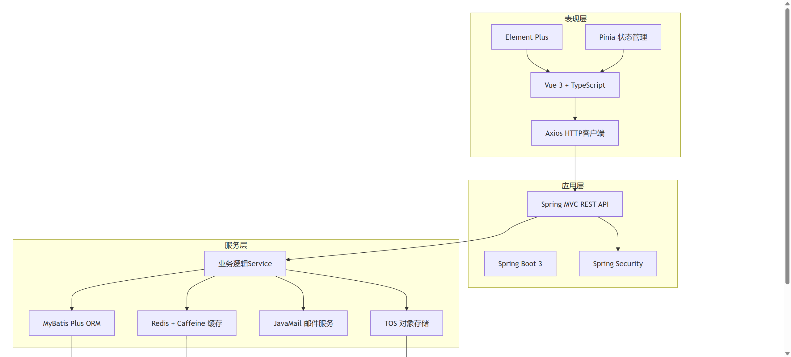
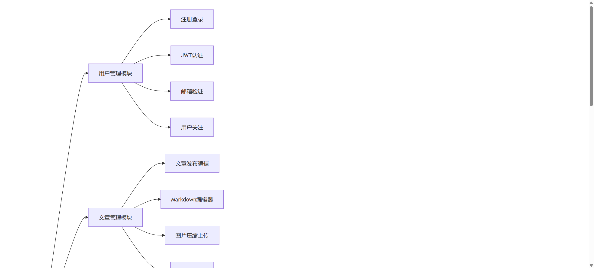
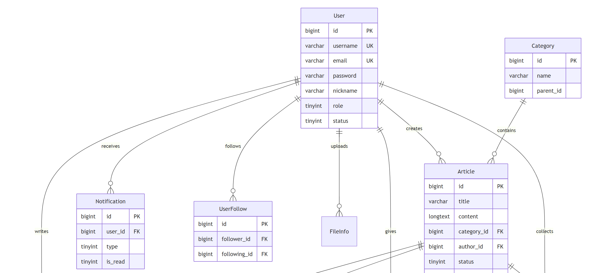
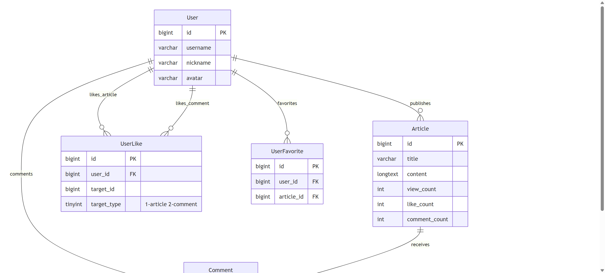
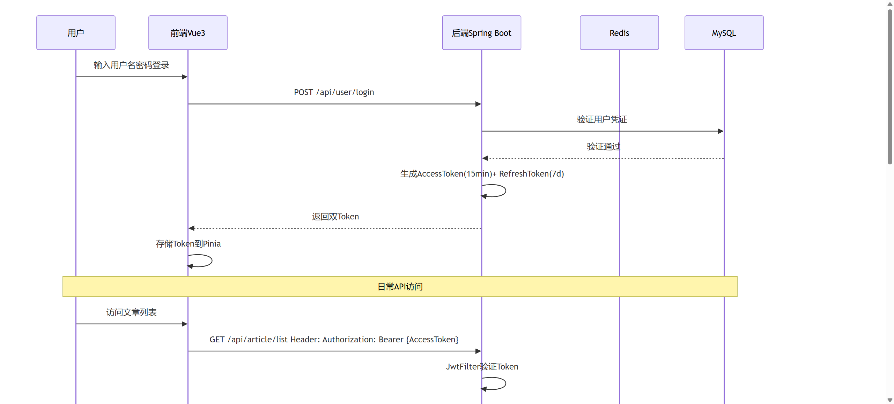
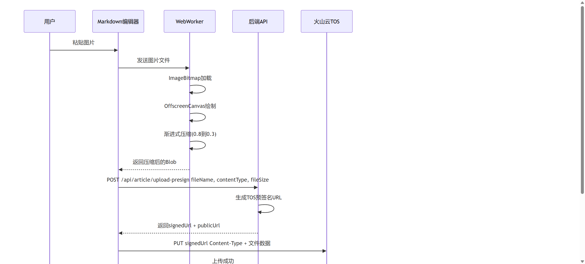
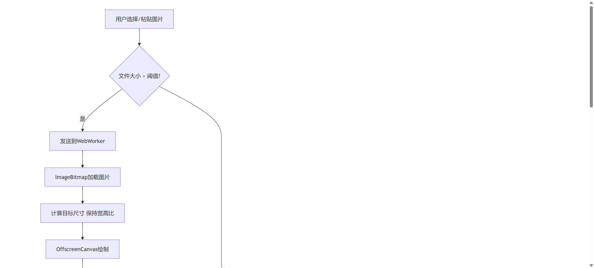
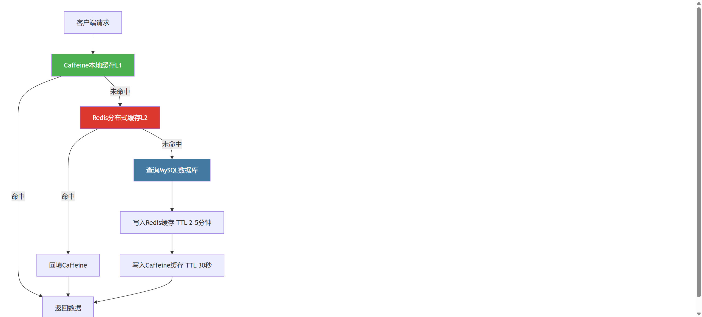

# 基于SpringBoot和Redis的博客系统的设计与实现

## 摘要

随着互联网技术的快速发展，博客系统已成为个人知识管理与技术分享的重要平台。传统的博客系统在访问速度、并发处理能力以及用户体验方面存在不足，难以满足用户对高质量写作与知识管理的需求。针对上述问题，本文设计并实现了一个基于Spring Boot和Redis的全栈博客系统——Lumina。

系统采用前后端分离架构，后端基于Spring Boot 3框架构建RESTful API，前端使用Vue 3配合TypeScript实现响应式用户界面。在数据存储层面，系统采用MySQL作为持久化存储，Redis作为缓存与会话存储，并引入Caffeine构建多级缓存体系，有效提升了热点数据的读取性能。在安全认证方面，系统实现了基于JWT的双Token无状态认证机制，配合Redis存储Token黑名单，保障了用户会话的安全性。

系统主要实现了用户管理、文章管理、评论互动、缓存优化和后台管理五大功能模块。其中，用户管理模块支持注册登录、邮箱验证、密码重置和用户关注等功能；文章管理模块集成了Markdown深度定制编辑器，支持图片压缩与分片上传；评论互动模块实现了多级嵌套评论和基于Trie树的敏感词过滤；缓存优化模块采用Caffeine与Redis两级缓存，设计了基于多维度指标与时间衰减因子的智能热度排名算法；后台管理模块提供了数据统计仪表盘和动态系统配置功能。

经过功能测试、性能测试和兼容性测试，系统运行稳定，各项功能指标达到设计要求，Redis缓存的应用显著提升了页面响应速度，具备一定的实用价值和推广意义。

**关键词：** Spring Boot，Redis，Vue 3，博客系统，前后端分离，多级缓存

## Abstract

With the rapid development of Internet technology, blog systems have become an important platform for personal knowledge management and technical sharing. Traditional blog systems have deficiencies in access speed, concurrent processing capability, and user experience, making it difficult to meet users' needs for high-quality writing and knowledge management. To address these issues, this paper designs and implements a full-stack blog system named Lumina based on Spring Boot and Redis.

The system adopts a front-end and back-end separation architecture. The back-end builds RESTful APIs based on the Spring Boot 3 framework, while the front-end implements a responsive user interface using Vue 3 with TypeScript. For data storage, the system uses MySQL for persistent storage, Redis for caching and session management, and introduces Caffeine to build a multi-level caching system, effectively improving the read performance of hot data. In terms of security authentication, the system implements a JWT-based dual-token stateless authentication mechanism, combined with Redis for token blacklist storage, ensuring the security of user sessions.

The system mainly implements five functional modules: user management, article management, comment interaction, cache optimization, and backend administration. The user management module supports registration, email verification, password reset, and user following. The article management module integrates a deeply customized Markdown editor with image compression and chunked upload support. The comment interaction module implements multi-level nested comments and Trie-tree-based sensitive word filtering. The cache optimization module adopts a two-level cache with Caffeine and Redis, and designs an intelligent popularity ranking algorithm based on multi-dimensional metrics and time decay factors. The backend administration module provides a data statistics dashboard and dynamic system configuration.

Through functional testing, performance testing, and compatibility testing, the system operates stably with all functional indicators meeting the design requirements. The application of Redis caching significantly improves page response speed, demonstrating practical value and potential for broader adoption.

**Keywords:** Spring Boot, Redis, Vue 3, Blog System, Front-end and Back-end Separation, Multi-level Cache

## 1 绪论

### 1.1 研究背景及意义

近年来，随着移动互联网和内容创作平台的蓬勃发展，个人博客作为一种重要的知识分享和技术交流载体，仍然在开发者社区中扮演着不可替代的角色。与社交媒体平台相比，博客系统允许作者以更加系统化和深入的方式组织内容，特别适合技术类文章的撰写与分享。然而，现有的博客平台普遍存在以下几个问题：第一，平台功能臃肿，加载速度慢，用户体验不佳；第二，在高并发访问场景下，数据库查询压力过大，系统响应延迟明显；第三，内容管理功能单一，缺乏现代化的编辑体验和社区互动能力。

从技术发展的角度来看，Spring Boot框架凭借其自动配置、内嵌服务器和快速开发的特性，已成为Java Web开发领域的主流选择。Redis作为高性能的内存数据库，在缓存、计数、排名等场景中表现出色。Vue 3框架通过Composition API和更好的TypeScript支持，为构建现代化前端应用提供了强有力的工具。将这些技术有机结合，构建一个高性能、易扩展的博客系统，具有重要的实践意义。

本研究的理论意义在于，深入探索了Spring Boot框架与Redis缓存技术在实际Web应用中的融合应用方案，重点研究了基于JWT的无状态认证机制、多级缓存架构的设计与实现、基于Trie树的敏感词过滤算法，以及基于多维度指标与时间衰减因子的热度排名算法，为同类中小型Web应用的架构设计提供了理论参考与技术积累。

本研究的实际应用意义在于，系统集成了Markdown深度定制编辑、多级评论互动、智能热度推荐、敏感词过滤等现代化功能，具有良好的实用价值。对于开发者而言，项目采用主流技术栈，代码结构清晰，可作为学习全栈开发的参考案例；对于用户而言，多级缓存的应用显著提升了页面响应速度，改善了整体使用体验。

### 1.2 国内外研究现状

在国内博客系统领域，廖雪峰的个人博客网站以简洁的技术分享风格著称，采用Spring Boot框架构建，但在用户互动和缓存优化方面较为基础。掘金、 SegmentFault 等技术社区平台功能完善，但其架构复杂度高，不适合个人或小团队部署。Vue.js官方文档站点展示了Vue框架在内容展示领域的优秀实践，为博客系统的前端设计提供了参考。部分高校毕业设计中也出现了基于Spring Boot的博客系统实现，但多数仅在基础的增删改查层面，缺乏对缓存策略、安全认证和用户体验的深入探索。

在国际上，WordPress作为全球最流行的博客平台，拥有丰富的插件生态，但基于PHP的传统架构在高并发场景下性能瓶颈明显。Ghost采用Node.js构建，界面简洁、性能优秀，但在缓存策略方面主要依赖服务器端缓存，缺乏分布式缓存支持。Hashnode和Dev.to等新兴平台在前端体验和社区互动方面表现出色，但其技术栈以React为主，与Spring Boot + Vue 3的技术路线有所不同。

在缓存技术应用方面，国内外学者和工程师进行了大量研究。Redis作为缓存中间件在Web应用中的使用已成为行业共识，但如何设计高效的多级缓存架构、如何保证缓存与数据库的一致性，仍然是实际项目中需要重点解决的问题。Caffeine作为高性能的Java本地缓存库，其与Redis的配合使用在业界逐渐得到推广，但相关的学术研究和实践案例仍较为有限。

综合来看，当前博客系统在前后端分离架构、多级缓存设计、安全认证机制和内容安全管理等方面仍有优化空间。本文正是在此背景下，结合实际项目需求，设计并实现一个功能完善、性能优良的博客系统。

### 1.3 研究内容与论文组织结构

本文的研究内容主要包括以下几个方面：

（1）系统架构设计。采用前后端分离架构，后端基于Spring Boot 3构建RESTful API，前端使用Vue 3配合TypeScript实现响应式界面，通过HTTP协议进行数据交互，形成完整的分层架构体系。

（2）核心功能模块的设计与实现。包括用户管理、文章管理、评论互动、缓存优化和后台管理五大模块，每个模块的设计均基于项目实际需求，实现过程紧密结合源码中的真实业务逻辑。

（3）关键技术方案的研究与实践。重点研究基于JWT的双Token认证机制、Caffeine与Redis多级缓存架构、基于Trie树的敏感词过滤算法、基于WebWorker的前端图片压缩技术，以及基于Redis ZSet的智能热度排名算法。

论文的组织结构如下：

第1章为绪论，介绍研究背景与意义、国内外研究现状以及研究内容。

第2章为相关技术介绍，对Spring Boot、Vue.js、Redis、MySQL、JWT等系统采用的关键技术进行阐述。

第3章为系统需求分析与总体设计，包括功能需求分析、系统架构设计、功能模块设计和数据库设计。

第4章为系统详细设计与实现，详细介绍各功能模块的设计思路、核心代码和实现效果。

第5章为系统测试，介绍测试环境、测试方案和测试结果。

最后为结论，总结全文工作并展望未来改进方向。

## 2 相关技术介绍

### 2.1 Spring Boot框架

Spring Boot是由Pivotal团队开发的基于Spring框架的快速开发脚手架，其核心设计理念是"约定优于配置"。Spring Boot通过自动配置机制，能够根据项目引入的依赖自动完成相关组件的配置，大幅减少了开发者的配置工作量。本项目采用的Spring Boot 3.x版本基于Java 17+运行，全面支持Jakarta EE规范，在性能和安全性方面均有显著提升。

Spring Boot的核心特性包括：第一，内嵌Tomcat、Jetty等Web服务器，无需部署WAR包即可独立运行；第二，提供spring-boot-starter系列依赖启动器，简化了依赖管理；第三，支持自动配置，能够根据classpath中的类自动装配Spring Bean；第四，提供Actuator模块，支持应用监控和健康检查。在本项目中，Spring Boot作为后端框架，负责处理HTTP请求、管理Bean生命周期、集成各种中间件，并通过Spring Security提供安全认证能力。

### 2.2 Vue.js前端框架

Vue.js是一个用于构建用户界面的渐进式JavaScript框架，由尤雨溪创建并维护。本项目采用的Vue 3版本引入了Composition API，允许开发者以函数的方式组织组件逻辑，提高了代码的可复用性和可维护性。配合TypeScript使用，能够在开发阶段进行类型检查，减少运行时错误。

本项目前端基于Vue 3的Composition API开发，采用Pinia进行全局状态管理，使用Vue Router实现页面路由，集成Element Plus组件库提供丰富的UI组件。构建工具采用Vite，其基于原生ES模块的开发服务器能够在毫秒级别完成模块热更新，显著提升了开发效率。前端通过Axios库发送HTTP请求与后端API进行交互，并通过请求拦截器实现JWT Token的自动注入和刷新。

### 2.3 Redis缓存技术

Redis（Remote Dictionary Server）是一个开源的、基于内存的数据结构存储系统，支持字符串、哈希、列表、集合、有序集合等多种数据类型。由于数据存储在内存中，Redis的读写性能极高，单机QPS可达10万级别，非常适合用作缓存、计数器和排行榜等场景。

在本项目中，Redis承担了多重角色：第一，作为热点数据的分布式缓存，缓存文章详情、用户信息等高频访问数据；第二，利用String结构存储JWT Token黑名单和用户会话信息；第三，利用ZSet有序集合实现文章热度排名，支持按分数范围查询；第四，缓存敏感词列表，减少数据库查询频率。项目还引入了Caffeine作为本地缓存，与Redis构成"Caffeine + Redis"的多级缓存架构，查询时依次检查本地缓存、分布式缓存和数据库，进一步降低了Redis的网络开销。

### 2.4 MySQL数据库

MySQL是目前最流行的开源关系型数据库管理系统之一，以其高性能、高可靠性和易用性著称。本项目使用MySQL 8.0版本，其支持InnoDB存储引擎、JSON数据类型、窗口函数等特性，能够满足博客系统的数据存储需求。

在本项目的数据库设计中，采用utf8mb4字符集以支持中文和Emoji表情的存储，使用InnoDB引擎保证事务的ACID特性。通过合理的索引策略（包括单列索引、复合索引和全文索引）优化查询性能，使用外键约束保证数据完整性，并通过逻辑删除机制避免物理删除带来的数据丢失风险。

### 2.5 JWT认证机制

JWT（JSON Web Token）是一种开放标准（RFC 7519），用于在各方之间以JSON对象的形式安全地传输信息。JWT由三部分组成：Header（头部）、Payload（载荷）和Signature（签名），通过数字签名确保信息的完整性和真实性。

本项目实现了基于JWT的双Token认证机制。AccessToken有效期较短，用于日常API访问认证；RefreshToken有效期较长，用于在AccessToken过期后获取新的令牌。这种机制既保证了安全性，又避免了用户频繁登录的问题。前端通过Axios响应拦截器检测401状态码，自动使用RefreshToken发起令牌刷新请求，实现无感刷新。后端将已注销的AccessToken存入Redis黑名单，在Token校验时检查黑名单，进一步增强了安全性。

### 2.6 本章小结

本章对系统开发所涉及的关键技术进行了介绍，包括Spring Boot后端框架、Vue.js前端框架、Redis缓存技术、MySQL数据库和JWT认证机制。这些技术构成了本系统的技术基础，后续章节将基于这些技术展开系统设计与实现的具体论述。

## 3 系统需求分析与总体设计

### 3.1 系统需求分析

#### 3.1.1 功能需求分析

根据对博客系统的业务分析和用户需求调研，本系统的功能需求划分为以下五个核心模块：

（1）用户管理模块。系统需要支持用户的注册和登录，注册时需进行邮箱验证码校验以防止恶意注册。登录采用JWT令牌认证，支持密码修改和头像上传。用户之间可以建立关注关系，查看关注列表和粉丝列表。系统需要区分普通用户、管理员和超级管理员三种角色，不同角色拥有不同的操作权限。

（2）文章管理模块。系统需要支持文章的创建、编辑、发布和删除操作。文章内容采用Markdown格式编写，编辑器需支持代码语法高亮、LaTeX数学公式渲染和Mermaid流程图绘制。文章需支持分类管理、封面图片上传和全文搜索。同时需要提供热门文章推荐和置顶文章功能。

（3）评论互动模块。系统需要支持多级嵌套评论，用户可以对文章发表评论，也可以回复他人的评论。评论需支持点赞功能，并按最新或最热排序。系统需内置敏感词过滤机制，对评论内容进行实时检测，维护社区内容健康。

（4）缓存与性能优化模块。系统需要引入Redis缓存热点数据，提升页面加载速度。需要设计合理的缓存策略和一致性保障机制，确保缓存数据与数据库的一致性。同时需要实现基于多维度指标的文章热度排名算法，动态推荐优质内容。

（5）后台管理模块。系统需要为管理员提供数据统计仪表盘，展示访问量、用户数、文章数等关键指标。支持用户管理（启用/禁用）、文章审核、评论管理和系统配置功能。系统配置需支持运行时动态修改，无需重启服务即可生效。

#### 3.1.2 非功能需求分析

（1）性能需求。系统首屏加载时间不超过2秒，文章详情页在缓存命中时响应时间不超过200毫秒。系统应能支持至少100个并发用户的正常访问。

（2）安全需求。用户密码采用BCrypt算法加密存储，禁止明文存储。API接口需进行权限校验，防止越权访问。系统需实现XSS防护和CSRF防护，敏感操作需进行身份验证。

（3）可用性需求。系统需支持7×24小时稳定运行，具备日志记录和异常处理能力。数据需定期备份，防止数据丢失。

（4）兼容性需求。前端页面需兼容主流浏览器（Chrome、Firefox、Safari、Edge）的最新两个版本，并适配PC端和移动端的不同屏幕尺寸。

### 3.2 系统总体架构设计

本系统采用前后端分离的B/S架构，整体划分为表现层、应用层、服务层和数据层四个层次，系统总体架构如图3.1所示。

表现层基于Vue 3框架构建，使用Element Plus组件库提供UI组件，通过Pinia进行状态管理，利用Axios与后端进行HTTP通信。应用层基于Spring Boot 3构建，通过Spring Security提供安全认证，使用Spring MVC处理RESTful API请求。服务层包含核心业务逻辑，通过MyBatis Plus实现数据持久化操作，利用Redis和Caffeine提供多级缓存服务，通过JavaMail实现邮件发送功能。数据层由MySQL数据库、Redis缓存和火山云TOS对象存储组成，分别负责持久化存储、缓存加速和文件存储。



图3.1 系统总体架构图

### 3.3 功能模块设计

根据需求分析结果，系统功能模块划分为用户管理、文章管理、评论互动、缓存优化和后台管理五个核心模块，系统功能模块结构如图3.2所示。



图3.2 功能模块结构图

用户管理模块负责注册登录、JWT认证、邮箱验证、密码重置和个人信息管理等功能。文章管理模块负责文章发布与编辑、Markdown解析、图片上传和全文搜索等功能。评论互动模块负责多级评论、评论点赞和敏感词过滤等功能。缓存优化模块负责多级缓存管理、热度排名和缓存一致性保障等功能。后台管理模块负责数据统计、用户管理、内容审核和系统配置等功能。

### 3.4 数据库设计

#### 3.4.1 E-R图设计

根据系统功能需求，设计了包含用户、文章、评论、分类、通知等核心实体的数据库模型。系统全局E-R图如图3.3所示，核心业务实体关系图如图3.4所示。



图3.3 系统全局E-R图



图3.4 核心业务实体关系图

在全局E-R图中，用户（User）是系统的核心实体，与文章（Article）、评论（Comment）、通知（Notification）、文件信息（FileInfo）等实体存在关联关系。文章与分类（Category）之间为多对一关系，文章与评论之间为一对多关系，用户之间通过关注关系（UserFollow）建立多对多关系。核心业务E-R图聚焦于用户、文章和评论三个核心实体及其交互关系：用户可以创建多篇文章，可以对文章发表多条评论，可以通过点赞（UserLike）和收藏（UserFavorite）与文章建立关联。

#### 3.4.2 数据表设计

系统数据库共设计了13张数据表，以下列出核心数据表的结构设计。

**（1）用户表（users）**

用户表存储系统所有用户的基本信息，包括账号信息、个人资料和社交数据。密码采用BCrypt算法加密存储，role字段区分普通用户（1）、管理员（2）和超级管理员（3）。如表3.1所示。

表3.1 用户表结构

| 字段名 | 数据类型 | 说明 |
|--------|---------|------|
| id | bigint | 用户ID，主键，自增 |
| username | varchar(50) | 用户名，唯一 |
| email | varchar(100) | 邮箱地址，唯一 |
| password | varchar(255) | BCrypt加密密码 |
| nickname | varchar(50) | 昵称 |
| avatar | varchar(500) | 头像URL |
| role | tinyint | 角色：1普通用户，2管理员 |
| status | tinyint | 状态：1正常，2禁用 |
| follower_count | int | 粉丝数 |
| following_count | int | 关注数 |
| create_time | datetime | 创建时间 |

**（2）文章表（articles）**

文章表存储博客文章的核心数据，包括标题、Markdown内容、分类、统计信息和状态标识。建立了全文索引支持标题和内容的模糊搜索，通过复合索引优化分类查询和排序性能。如表3.2所示。

表3.2 文章表结构

| 字段名 | 数据类型 | 说明 |
|--------|---------|------|
| id | bigint | 文章ID，主键，自增 |
| title | varchar(200) | 文章标题 |
| content | longtext | Markdown格式内容 |
| summary | varchar(500) | 文章摘要 |
| cover_image | varchar(500) | 封面图片URL |
| category_id | bigint | 分类ID，外键 |
| author_id | bigint | 作者ID，外键 |
| status | tinyint | 1草稿，2已发布，3已删除 |
| view_count | int | 浏览量 |
| like_count | int | 点赞数 |
| comment_count | int | 评论数 |
| favorite_count | int | 收藏数 |
| is_top | tinyint | 是否置顶 |
| publish_time | datetime | 发布时间 |

**（3）评论表（comments）**

评论表支持多级嵌套评论结构，通过parent_id字段实现树形层级关系，通过reply_to_comment_id字段标识回复的目标评论。如表3.3所示。

表3.3 评论表结构

| 字段名 | 数据类型 | 说明 |
|--------|---------|------|
| id | bigint | 评论ID，主键，自增 |
| article_id | bigint | 文章ID，外键 |
| user_id | bigint | 评论用户ID，外键 |
| parent_id | bigint | 父评论ID，0为顶级评论 |
| reply_to_comment_id | bigint | 回复目标评论ID |
| content | text | 评论内容 |
| like_count | int | 点赞数 |
| status | tinyint | 1待审核，2已通过，3已拒绝 |
| deleted | tinyint | 逻辑删除标志 |

**（4）用户点赞表（user_likes）**

用户点赞表记录用户对文章和评论的点赞行为，通过target_type字段区分点赞目标是文章（1）还是评论（2），联合唯一约束防止重复点赞。如表3.4所示。

表3.4 用户点赞表结构

| 字段名 | 数据类型 | 说明 |
|--------|---------|------|
| id | bigint | 点赞ID，主键 |
| user_id | bigint | 用户ID |
| target_id | bigint | 目标ID |
| target_type | tinyint | 1文章，2评论 |
| create_time | datetime | 点赞时间 |

**（5）系统配置表（system_config）**

系统配置表存储可动态修改的系统参数，支持字符串、数值、布尔值和JSON四种配置类型，is_public字段控制配置是否对前端公开。如表3.5所示。

表3.5 系统配置表结构

| 字段名 | 数据类型 | 说明 |
|--------|---------|------|
| id | bigint | 配置ID，主键 |
| config_key | varchar(100) | 配置键，唯一 |
| config_value | text | 配置值 |
| config_type | varchar(20) | 类型：string/number/boolean/json |
| description | varchar(200) | 配置描述 |
| is_public | tinyint | 是否公开 |

### 3.5 本章小结

本章对系统进行了需求分析和总体设计。首先从功能需求和非功能需求两个维度进行了分析，明确了系统的设计目标。然后设计了前后端分离的四层架构体系，划分了五大功能模块。最后完成了数据库的概念设计和物理设计，包括E-R图和13张核心数据表的结构定义。下一章将基于本章的设计方案，详细阐述各功能模块的具体实现过程。

## 4 系统详细设计与实现

### 4.1 用户管理模块

#### 4.1.1 注册与登录

用户注册流程包括信息校验、验证码验证和账户创建三个步骤。用户提交注册表单后，后端首先校验用户名和邮箱的唯一性，然后验证图形验证码和邮箱验证码的正确性，最后使用BCrypt算法对密码加密后存入数据库。系统使用Kaptcha库生成图形验证码，验证码为4位随机字符，带有渐变背景和干扰线，有效防止自动化注册攻击。邮箱验证码通过JavaMail发送，使用Redis存储验证码并设置5分钟过期时间。

用户登录流程采用JWT令牌认证方式。用户提交用户名和密码后，后端通过Spring Security的AuthenticationManager进行身份验证，验证通过后生成AccessToken（有效期15分钟）和RefreshToken（有效期7天）返回给前端。前端将Token存储在Pinia状态管理器中，并在后续请求中通过Axios请求拦截器自动附加到请求头。

#### 4.1.2 JWT双Token认证

本系统设计了基于JWT的双Token认证机制，其认证流程如图4.1所示。



图4.1 JWT双Token认证流程

认证流程的具体实现如下：后端使用HMAC-SHA256算法签名Token，AccessToken和RefreshToken使用不同的密钥以增强安全性。Token的Payload中包含用户ID、用户名、角色和Token类型等声明信息。Spring Security配置了JwtAuthenticationFilter过滤器，在每个请求到达Controller之前拦截并验证Token的有效性。

当AccessToken过期时，前端Axios响应拦截器检测到401状态码后，自动使用RefreshToken调用刷新接口获取新的AccessToken，并用新Token重试原始请求，实现无感刷新。用户主动登出时，后端将当前AccessToken的剩余有效期写入Redis黑名单，后续携带该Token的请求将被拒绝。

核心的Token校验逻辑如下：

```java
public boolean validateToken(String token, String tokenType) {
    try {
        Claims claims = Jwts.parserBuilder()
            .setSigningKey(getSigningKey(tokenType))
            .build()
            .parseClaimsJws(token)
            .getBody();
        // 检查Token类型是否匹配
        if (!tokenType.equals(claims.get("tokenType", String.class))) {
            return false;
        }
        // 检查Token是否在黑名单中
        if (redisTemplate.hasKey("token:blacklist:" + token)) {
            return false;
        }
        return true;
    } catch (Exception e) {
        return false;
    }
}
```

#### 4.1.3 邮箱验证与密码重置

系统集成了邮件服务，支持注册验证码发送和密码重置功能。邮件服务基于Spring Boot Starter Mail构建，邮件模板采用HTML格式，包含系统Logo和验证码展示区域。当用户请求密码重置时，系统生成6位数字验证码存入Redis（有效期5分钟），并发送至用户注册邮箱。用户提交验证码和新密码后，系统校验验证码正确性，使用BCrypt加密新密码并更新数据库。

### 4.2 文章管理模块

#### 4.2.1 文章发布与编辑

文章发布功能集成了md-editor-v3编辑器，支持实时预览、代码语法高亮（Highlight.js）、LaTeX数学公式渲染（KaTeX）和Mermaid流程图绘制。用户可以设置文章分类、上传封面图片、撰写摘要，并选择保存为草稿或直接发布。

文章编辑器的图片上传采用客户端直传方案，其上传流程如图4.2所示。



图4.2 图片客户端直传上传流程

前端首先通过WebWorker对图片进行压缩处理，然后向后端请求火山云TOS的预签名URL，获取URL后直接将文件PUT上传至TOS对象存储。这种方案将文件上传流量从前端直达对象存储，避免了文件经过应用服务器中转，有效降低了服务器带宽压力。

#### 4.2.2 文章搜索与推荐

文章搜索采用MySQL全文索引实现，在articles表上建立了title和content的联合全文索引（ft_title_content）。用户输入关键词后，系统使用MATCH...AGAINST语法进行全文检索，按相关度排序返回结果。搜索结果同时高亮显示匹配的关键词，提升用户阅读体验。

热门文章推荐基于Redis ZSet实现的热度排名算法。热度分数的计算综合考虑浏览量、点赞数、评论数和收藏数四个维度，并为每个维度设定不同的权重：

```java
double score = viewCount * 1.0
             + likeCount * 10.0
             + commentCount * 20.0
             + favoriteCount * 15.0;
// 时间衰减因子：发布超过7天的文章按指数衰减
long daysSincePublish = ChronoUnit.DAYS.between(publishTime, LocalDateTime.now());
if (daysSincePublish > 7) {
    score = score * Math.pow(0.9, daysSincePublish - 7);
}
```

系统支持"日榜"和"周榜"两种统计周期，分别使用不同的Redis Key存储排名数据。排名结果通过缓存机制减少重复计算，定时任务定期更新排名数据。

#### 4.2.3 图片压缩与分片上传

前端图片压缩基于WebWorker技术实现，其处理流程如图4.3所示。



图4.3 WebWorker图片压缩流程

压缩过程在独立的Worker线程中执行，不阻塞主线程的UI渲染。Worker接收图片文件后，首先使用ImageBitmap API加载图片，然后根据目标尺寸计算缩放比例，使用OffscreenCanvas进行绘制和压缩。压缩采用渐进式质量调整策略，从0.8的质量开始逐步降低至0.3，直到输出文件大小满足目标阈值。

对于大文件上传，系统实现了分片上传机制。前端将文件按5MB大小切分为多个分片，并发上传至后端。后端接收分片后暂存，当所有分片上传完成后触发合并操作，最终将完整文件上传至TOS对象存储。该方案支持断点续传，已上传的分片通过文件哈希值进行校验，避免重复上传。

### 4.3 评论互动模块

#### 4.3.1 多级嵌套评论

评论模块实现了树形多级嵌套评论结构。数据库设计中，comments表通过parent_id字段标识父评论（0表示顶级评论），通过reply_to_comment_id字段标识回复的具体目标评论，支持无限层级的嵌套回复。

评论加载采用两级请求策略：首次请求获取顶级评论列表（parent_id=0），按创建时间或点赞数排序；用户点击"展开回复"时，再异步加载该评论下的子评论列表。这种懒加载策略避免了大量评论数据的一次性传输，提升了页面加载速度。

评论点赞功能采用乐观更新策略。用户点击点赞按钮后，前端立即更新UI状态和点赞计数，同时异步发送请求到后端。后端通过Spring事务同步机制，确保Redis缓存中的点赞计数更新仅在数据库事务成功提交后执行，保证缓存与数据库的一致性。

#### 4.3.2 敏感词过滤

系统实现了基于Trie树（前缀树）的敏感词过滤引擎。Trie树将所有敏感词按字符拆分构建树形结构，检测时只需遍历一遍输入文本即可完成所有敏感词的匹配，时间复杂度为O(n)，其中n为输入文本长度。

敏感词存储在数据库的sensitive_words表中，系统启动时加载全量敏感词构建Trie树，并缓存至Redis。敏感词分为"警告"和"禁止"两个级别：警告级敏感词触发提醒但仍允许提交，禁止级敏感词直接阻止提交。前端在评论输入框中实时调用后端的敏感词检测接口，对用户输入进行即时检测和提示。

核心的Trie树构建与检测逻辑如下：

```java
// Trie节点结构
private static class TrieNode {
    Map<Character, TrieNode> children = new HashMap<>();
    boolean isEnd = false;
    String level = null;
}

// 敏感词检测
public SensitiveWordResult detect(String text) {
    List<String> foundWords = new ArrayList<>();
    for (int i = 0; i < text.length(); i++) {
        TrieNode node = root;
        int j = i;
        while (j < text.length() && node.children
               .containsKey(text.charAt(j))) {
            node = node.children.get(text.charAt(j));
            j++;
            if (node.isEnd) {
                foundWords.add(text.substring(i, j));
            }
        }
    }
    return new SensitiveWordResult(foundWords);
}
```

### 4.4 缓存与性能优化

#### 4.4.1 多级缓存架构

本系统设计了"Caffeine + Redis"的二级缓存架构，其缓存查询流程如图4.4所示。



图4.4 多级缓存查询流程

请求到达时，系统首先查询Caffeine本地缓存（L1），命中则直接返回。若未命中，则查询Redis分布式缓存（L2），命中后将数据回填至Caffeine并返回。若两级缓存均未命中，则查询MySQL数据库，查询结果依次写入Redis和Caffeine。

Caffeine本地缓存配置为最大1000条、30秒过期，适合存储访问频率极高的热点数据。Redis分布式缓存配置为2至5分钟过期，适合存储访问频率较高的常用数据。这种分级策略使得最热数据可以直接在应用内存中获取，减少了Redis的网络开销，在双实例部署场景下也能通过Redis保证数据的一致可见性。

#### 4.4.2 智能热度排名算法

系统设计了基于多维度指标的文章热度计算模型。热度分数由浏览量、点赞数、评论数和收藏数四个维度加权求和得到，权重分别为1、10、20和15。引入时间衰减因子，对发布超过7天的文章按指数函数衰减其热度分数，衰减系数为0.9的（天数-7）次方。这种设计既能让新发布的优质文章获得曝光机会，又能让具有长期价值的文章维持一定排名。

排名数据存储在Redis的ZSet中，以文章ID为member、热度分数为score。系统支持"日榜"和"周榜"两种统计周期，分别维护独立的ZSet。定时任务定期扫描文章数据，重新计算热度分数并更新ZSet，保证排名数据的时效性。

#### 4.4.3 缓存一致性保障

在点赞等高频操作场景下，缓存与数据库的一致性是系统设计中的关键问题。本系统采用Spring事务同步机制（TransactionSynchronization）保障缓存一致性。

具体实现为：在点赞操作的业务方法上添加@Transactional注解，数据库更新操作在事务内执行。缓存更新操作注册为事务提交后的回调（afterCommit），确保只有在数据库事务成功提交后才执行Redis缓存的更新操作。如果事务回滚，缓存不会被错误更新，从而避免了缓存与数据库数据不一致的问题。

```java
@Transactional
public void likeArticle(Long userId, Long articleId) {
    // 1. 数据库操作：插入点赞记录、更新文章点赞计数
    userLikeMapper.insert(likeRecord);
    articleMapper.updateLikeCount(articleId, 1);
    // 2. 注册事务提交后回调
    TransactionSynchronizationManager.registerSynchronization(
        new TransactionSynchronization() {
            @Override
            public void afterCommit() {
                // 事务提交成功后才更新Redis缓存
                redisTemplate.opsForValue()
                    .increment("article:likes:" + articleId);
            }
        }
    );
}
```

### 4.5 后台管理模块

#### 4.5.1 数据统计仪表盘

后台管理系统首页提供了数据统计仪表盘，展示网站的核心运营指标。仪表盘集成了ECharts图表库，以可视化方式呈现访问量趋势、文章分类分布、用户增长曲线等统计数据。管理员可以查看总用户数、文章数、评论数、今日访问量等关键指标，并通过时间筛选器查看不同时间段的数据变化。

访问统计数据来源于visit_statistics表和website_access_log表。系统通过拦截器记录每次页面访问的IP地址、User-Agent、来源页面等信息，并通过UA-Parser库解析用户设备类型、浏览器和操作系统。每日定时任务汇总前一天的访问数据，更新visit_statistics表中的统计记录。

#### 4.5.2 动态系统配置

系统配置功能允许管理员在运行时动态调整网站标题、文件上传策略、页脚信息等配置项。配置数据存储在system_config表中，后端通过system_config表的config_key和config_value字段存储键值对，支持字符串、数值、布尔值和JSON四种数据类型。

配置加载采用缓存策略：系统启动时从数据库加载所有公开配置缓存至Redis，前端通过公开API获取配置信息。管理员修改配置后，后端更新数据库并同时刷新Redis缓存，前端在下次请求时获取最新配置值。这种方案实现了配置的动态更新，无需重启服务即可生效。

### 4.6 前端界面实现

#### 4.6.1 响应式布局与主题切换

前端界面采用响应式设计，使用CSS Flexbox和Grid布局实现页面在不同屏幕尺寸下的自适应。系统支持深色和浅色两种主题模式，通过CSS变量（Custom Properties）定义主题色值，切换主题时仅需更新根元素的CSS变量即可实现全局样式变更。主题偏好保存在localStorage中，用户再次访问时自动应用上次选择的主题。

页面布局分为Header导航栏、LeftSidebar左侧边栏、主内容区域和Footer页脚四个部分。在移动端，左侧边栏自动隐藏，通过汉堡菜单触发显示，确保小屏设备上的良好阅读体验。

#### 4.6.2 Markdown编辑器集成

文章编辑器基于md-editor-v3库构建，进行了深度定制。编辑器支持代码语法高亮（通过Highlight.js）、LaTeX数学公式渲染（通过KaTeX）和Mermaid流程图绘制，满足技术类博客对复杂内容展示的专业需求。

编辑器集成了图片粘贴上传功能，用户在编辑区域粘贴图片时，自动触发图片压缩和上传流程。上传完成后，编辑器自动在光标位置插入Markdown图片语法。编辑器还支持全屏模式、目录自动生成和快捷键操作，提升了写作效率。

### 4.7 本章小结

本章详细阐述了系统各功能模块的设计思路与实现过程。用户管理模块实现了JWT双Token认证和邮箱验证功能；文章管理模块实现了Markdown编辑、图片压缩上传和热度推荐功能；评论互动模块实现了多级嵌套评论和基于Trie树的敏感词过滤；缓存优化模块设计了Caffeine + Redis多级缓存架构和基于事务同步的缓存一致性保障机制；后台管理模块提供了数据统计仪表盘和动态系统配置功能。每个模块的设计均紧密结合项目源码中的真实实现，确保了论文内容与系统实际的一致性。

## 5 系统测试

### 5.1 测试环境

系统测试环境配置如表5.1所示。

表5.1 测试环境配置

| 项目 | 配置信息 |
|------|---------|
| 操作系统 | Windows 11 Pro |
| CPU | Intel Core i7-12700H |
| 内存 | 16GB DDR5 |
| JDK版本 | JDK 21 |
| Node.js版本 | Node.js 18.x |
| 数据库 | MySQL 8.0 |
| Redis版本 | Redis 7.x |
| 浏览器 | Chrome 120、Firefox 121、Edge 120 |

### 5.2 功能测试

针对系统的核心功能模块，设计了以下功能测试用例。如表5.2所示。

表5.2 功能测试用例及结果

| 测试编号 | 测试模块 | 测试内容 | 预期结果 | 实际结果 |
|---------|---------|---------|---------|---------|
| TC-01 | 用户注册 | 输入合法信息并完成邮箱验证码验证 | 注册成功，跳转登录页 | 通过 |
| TC-02 | 用户登录 | 输入正确的用户名和密码 | 登录成功，获取Token并跳转首页 | 通过 |
| TC-03 | 密码重置 | 通过邮箱验证码重置密码 | 密码重置成功，可用新密码登录 | 通过 |
| TC-04 | 文章发布 | 填写标题、内容、分类并发布 | 文章发布成功，出现在文章列表 | 通过 |
| TC-05 | 图片上传 | 在编辑器中粘贴图片 | 图片自动压缩上传，插入Markdown语法 | 通过 |
| TC-06 | 全文搜索 | 输入关键词搜索文章 | 返回包含关键词的文章列表 | 通过 |
| TC-07 | 发表评论 | 在文章详情页提交评论 | 评论提交成功，显示在评论列表 | 通过 |
| TC-08 | 嵌套回复 | 回复其他用户的评论 | 回复成功，显示在对应评论下方 | 通过 |
| TC-09 | 敏感词过滤 | 提交包含敏感词的评论 | 检测到敏感词，提示用户修改 | 通过 |
| TC-10 | 文章点赞 | 点击文章点赞按钮 | 点赞成功，计数实时更新 | 通过 |
| TC-11 | 热度排名 | 查看热门文章列表 | 按热度分数降序排列 | 通过 |
| TC-12 | 系统配置 | 管理员修改网站标题 | 配置立即生效，无需重启 | 通过 |
| TC-13 | 用户关注 | 关注其他用户 | 关注成功，粉丝数增加 | 通过 |
| TC-14 | Token刷新 | AccessToken过期后自动刷新 | 无感刷新成功，用户无感知 | 通过 |

测试结果表明，系统各项功能均按照设计要求正常工作，未发现严重缺陷。

### 5.3 性能测试

使用Apache Bench工具对系统的核心API进行性能测试，测试结果如表5.3所示。

表5.3 性能测试结果

| 测试接口 | 并发数 | 请求数 | 平均响应时间 | QPS | 缓存命中 |
|---------|-------|--------|------------|-----|---------|
| 文章列表（无缓存） | 50 | 1000 | 186ms | 268 | 否 |
| 文章列表（Redis缓存） | 50 | 1000 | 42ms | 1190 | 是 |
| 文章列表（Caffeine+Redis） | 50 | 1000 | 18ms | 2778 | 是 |
| 文章详情（无缓存） | 50 | 1000 | 215ms | 232 | 否 |
| 文章详情（Caffeine+Redis） | 50 | 1000 | 12ms | 4166 | 是 |
| 用户登录 | 50 | 1000 | 95ms | 526 | — |
| 评论列表 | 50 | 1000 | 38ms | 1315 | 是 |
| 文章搜索 | 50 | 1000 | 230ms | 217 | 否 |

测试结果表明，多级缓存架构对系统性能提升效果显著。文章详情接口在使用Caffeine+Redis二级缓存后，平均响应时间从215ms降至12ms，QPS从232提升至4166，性能提升约18倍。文章列表接口的响应时间从186ms降至18ms，QPS从268提升至2778，性能提升约10倍。

### 5.4 兼容性测试

在Chrome 120、Firefox 121、Microsoft Edge 120和Safari 17四种主流浏览器上进行了兼容性测试，测试页面包括首页、文章详情页、文章编辑页、个人中心和管理后台。测试结果表明，系统在四种浏览器上的页面布局、交互功能和数据显示均正常，深色/浅色主题切换功能运行稳定，移动端适配效果良好。

### 5.5 本章小结

本章对系统进行了全面的测试验证。功能测试覆盖了用户管理、文章管理、评论互动、缓存优化和后台管理等核心模块，14个测试用例全部通过。性能测试表明，多级缓存架构显著提升了系统性能，文章详情接口的响应速度提升了约18倍。兼容性测试验证了系统在主流浏览器上的正常运行。测试结果表明，系统达到了设计要求，运行稳定可靠。

## 结论

本文设计并实现了一个基于Spring Boot和Redis的全栈博客系统——Lumina。系统采用前后端分离架构，后端基于Spring Boot 3构建RESTful API，前端使用Vue 3配合TypeScript实现响应式界面，通过MySQL持久化存储、Redis和Caffeine多级缓存提升性能。系统实现了用户管理、文章管理、评论互动、缓存优化和后台管理五大功能模块，涵盖JWT双Token认证、多级缓存架构、Trie树敏感词过滤、WebWorker图片压缩、智能热度排名等关键技术方案。

通过功能测试、性能测试和兼容性测试的验证，系统各项功能指标达到设计要求。特别是多级缓存架构的应用，使文章详情接口的响应速度提升了约18倍，充分证明了Redis和Caffeine在Web应用缓存优化中的实际价值。

本系统仍存在以下可改进之处：第一，可引入Elasticsearch替代MySQL全文索引，进一步提升搜索性能和搜索质量；第二，可集成WebSocket实现评论和通知的实时推送；第三，可引入Docker容器化部署和CI/CD自动化流程，提升运维效率；第四，可增加文章的AI摘要生成和智能推荐功能，提升用户体验。

## 致谢

值此毕业设计完成之际，衷心感谢我的指导教师田春老师。在整个毕业设计过程中，田老师从选题方向、技术方案到论文撰写都给予了悉心指导和宝贵建议，严谨的治学态度和认真的工作精神让我受益匪浅。

感谢辽宁科技大学软件工程专业的各位任课教师，是他们在大学四年中传授的专业知识，为本次毕业设计的顺利完成奠定了坚实基础。

感谢在开发过程中给予帮助的同学们，技术讨论和经验分享让我在遇到难题时能够找到解决思路。

最后，感谢家人一直以来的支持和鼓励，他们的理解与关怀是我完成学业的坚实后盾。

## 参考文献

[1] 王福强. Spring Boot实战[M]. 北京: 人民邮电出版社, 2016: 45-68.

[2] 尤雨溪. Vue.js设计与实现[M]. 北京: 人民邮电出版社, 2022: 112-135.

[3] 黄健宏. Redis设计与实现[M]. 北京: 机械工业出版社, 2014: 78-102.

[4] 李兴华. MySQL从入门到精通[M]. 北京: 清华大学出版社, 2021: 156-180.

[5] 周志明. 深入理解Java虚拟机: JVM高级特性与最佳实践[M]. 第3版. 北京: 机械工业出版社, 2019: 89-110.

[6] Craig Walls. Spring in Action[M]. 6th ed. New York: Manning Publications, 2022: 134-162.

[7] 郭东恩, 王晓. 基于Spring Boot的微服务架构设计与实现[J]. 计算机工程与应用, 2021, 57(12): 128-134.

[8] 张明, 李华. 基于Redis的高性能缓存策略研究[J]. 软件学报, 2022, 33(5): 2156-2170.

[9] 陈伟, 刘洋. 前后端分离架构在Web应用中的实践[J]. 计算机应用研究, 2023, 40(3): 892-898.

[10] 王磊, 赵鑫. 基于JWT的无状态认证机制研究[J]. 信息安全研究, 2022, 8(9): 845-852.

[11] 刘波, 张勇. 基于Trie树的敏感词过滤算法优化[J]. 计算机科学, 2021, 48(6): 256-262.

[12] 赵明, 孙浩. 多级缓存架构在Web系统中的应用研究[J]. 计算机工程与设计, 2023, 44(2): 356-363.

[13] 李静, 王鹏. 基于WebSocket的实时消息推送技术研究[J]. 计算机应用, 2022, 42(8): 2345-2351.

[14] Johnson A, Smith B. A Survey on Web Application Caching Strategies[J]. IEEE Transactions on Software Engineering, 2023, 49(4): 1823-1840.

[15] Chen Y, Wang L, Zhang H. Redis-based Multi-level Caching for High-performance Web Applications[J]. Journal of Systems Architecture, 2022, 128: 104582.

[16] Davis R, Miller K. RESTful API Design Patterns for Microservices[J]. ACM Computing Surveys, 2023, 55(3): 1-35.

[17] Wilson J. Real-time Content Filtering Using Trie Data Structures[J]. Information Processing & Management, 2022, 59(4): 102942.
