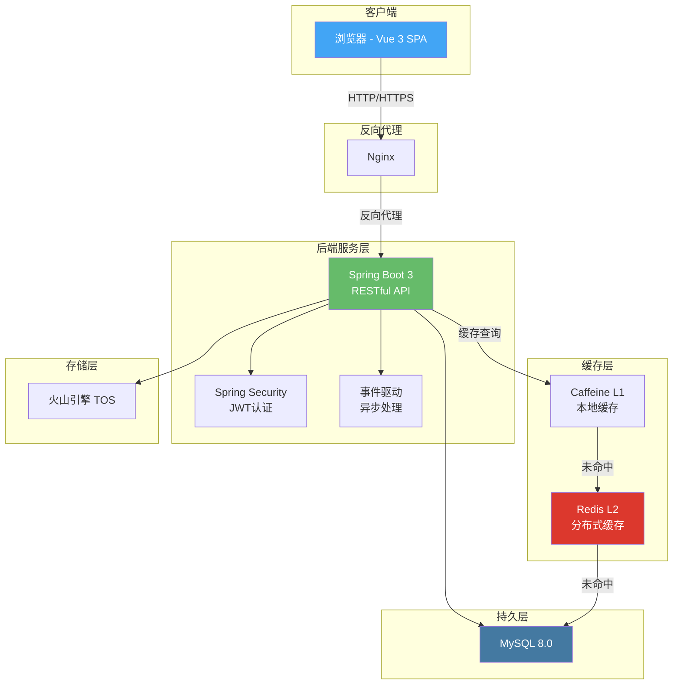
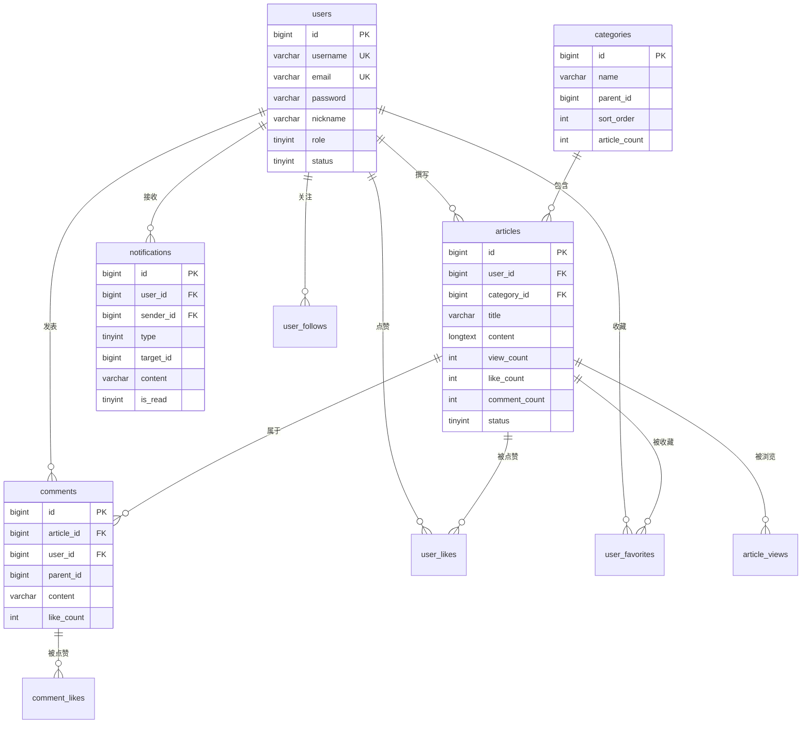
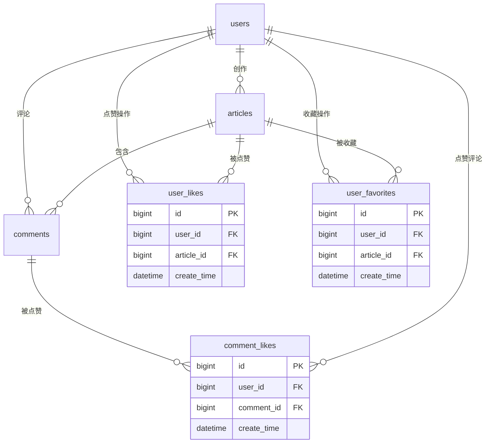
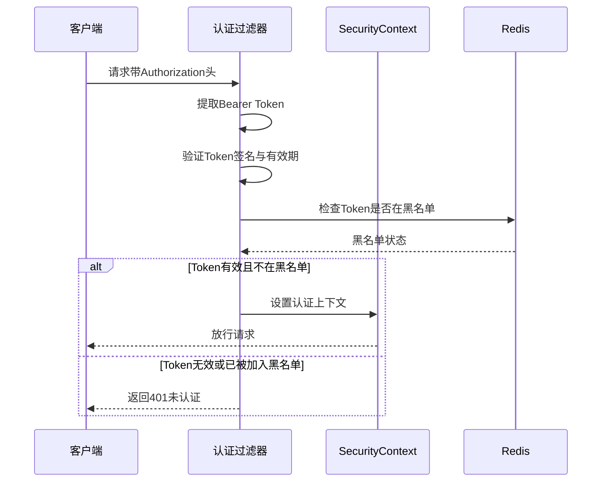
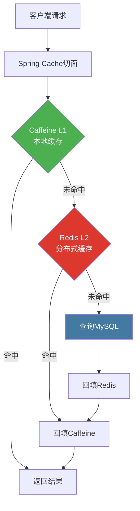
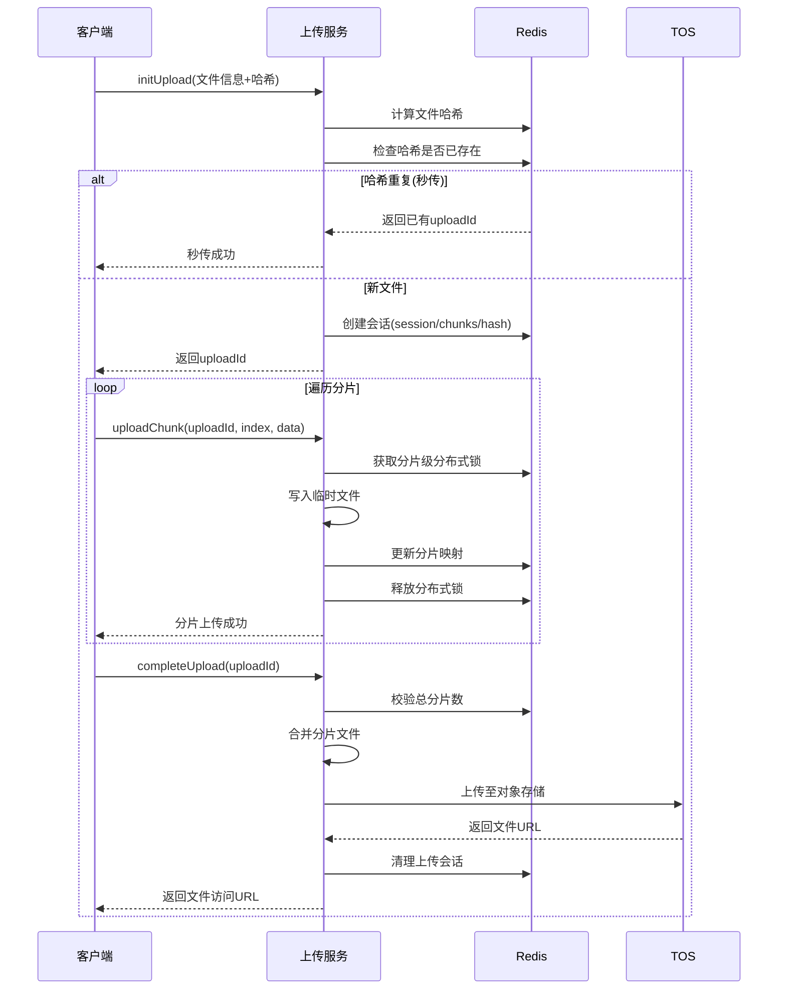

# 基于SpringBoot和Redis的博客系统的设计与实现

## 摘要

随着互联网技术的快速发展，个人知识管理与内容创作平台的需求日益增长。传统的博客系统在面临高并发访问、实时数据统计和复杂内容管理时往往存在性能瓶颈。本文设计并实现了一个基于Spring Boot 3和Vue 3的全栈博客系统——Lumina，重点解决了高并发场景下的缓存一致性问题、文章热度实时排行问题以及大文件上传的可靠性问题。

系统后端采用Spring Boot 3.5.6作为核心框架，整合Spring Security与JWT实现无状态认证，使用MyBatis Plus作为ORM框架操作MySQL数据库，并深度集成Redis实现了多级缓存架构、分布式锁以及文章热度排行等高级功能。前端基于Vue 3 Composition API与TypeScript构建，采用Vite作为构建工具，Element Plus作为UI组件库，并集成了MD Editor v3编辑器以支持Markdown、数学公式和流程图的全能创作体验。

本文的核心技术亮点包括：设计并实现了Caffeine本地缓存与Redis分布式缓存相结合的两级缓存架构，通过CompositeCacheManager实现L1到L2的级联查询，显著降低了数据库访问压力；基于Redis ZSet与Lua原子脚本设计了文章热度排行算法，支持日榜和周榜的实时计算与定时重置；实现了完整的Redis分布式锁组件，包含基于Lua脚本的原子解锁与看门狗自动续期机制，为点赞、收藏、评论等高并发操作提供数据一致性保障；设计了基于Redis Hash的分片上传会话管理方案，结合文件哈希去重与分片级分布式锁，解决了大文件上传的可靠性和断点续传问题；基于事件驱动架构实现了通知推送、内容审核和缓存失效传播等异步处理流程。

测试结果表明，系统在高并发场景下响应时间稳定，缓存命中率超过90%，具备良好的可用性和扩展性。

**关键词：** Spring Boot；Redis；博客系统；分布式锁；热度排行；多级缓存

## Abstract

With the rapid development of Internet technology, the demand for personal knowledge management and content creation platforms is increasing. Traditional blog systems often face performance bottlenecks when dealing with high-concurrency access, real-time data statistics, and complex content management. This paper designs and implements a full-stack blog system named Lumina based on Spring Boot 3 and Vue 3, focusing on solving cache consistency issues under high concurrency, real-time article hotness ranking, and reliability of large file uploads.

The backend adopts Spring Boot 3.5.6 as the core framework, integrates Spring Security with JWT for stateless authentication, uses MyBatis Plus as the ORM framework to operate MySQL databases, and deeply integrates Redis to implement multi-level caching architecture, distributed locks, and article hotness ranking. The frontend is built with Vue 3 Composition API and TypeScript, using Vite as the build tool, Element Plus as the UI component library, and integrating the MD Editor v3 to support Markdown, mathematical formulas, and flowcharts for a comprehensive creation experience.

The core technical highlights of this paper include: a two-level caching architecture combining Caffeine local cache and Redis distributed cache, achieving cascaded queries from L1 to L2 through CompositeCacheManager to significantly reduce database access pressure; an article hotness ranking algorithm based on Redis ZSet and Lua atomic scripts, supporting real-time calculation and scheduled reset of daily and weekly rankings; a complete Redis distributed lock component with Lua script-based atomic unlocking and watchdog automatic renewal mechanism, providing data consistency guarantees for high-concurrency operations such as likes, favorites, and comments; a Redis Hash-based chunked upload session management scheme combined with file hash deduplication and chunk-level distributed locks, solving the reliability and resumable upload problems of large file uploads; and an event-driven architecture for asynchronous processing flows such as notification pushing, content moderation, and cache invalidation propagation.

Test results show that the system maintains stable response times under high concurrency with a cache hit rate exceeding 90%, demonstrating good availability and scalability.

**Keywords:** Spring Boot; Redis; Blog System; Distributed Lock; Hotness Ranking; Multi-level Cache

## 1 绪论

### 1.1 研究背景及意义

在Web 2.0时代向Web 3.0过渡的背景下，个人内容创作已成为互联网生态的重要组成部分。博客作为个人知识管理、技术分享和思想表达的核心载体，经历了从早期WordPress等单体架构到现代前后端分离的微服务化演变。然而，现有主流博客平台普遍存在以下痛点：一是内容创作者对数据自主权的需求与平台中心化之间的矛盾；二是高并发场景下动态内容加载的延迟问题；三是缺乏精细化的内容管理与社区互动机制。

近年来，Spring Boot凭借其自动配置、起步依赖和内嵌服务器等特性，已成为Java企业级应用开发的主流框架。Redis作为高性能的键值存储系统，在缓存加速、分布式锁和实时排行榜等场景中展现出强大的能力。Vue 3的Composition API和TypeScript支持为前端开发带来了更好的代码组织和类型安全保障。这三者技术栈的组合，为构建高性能、可扩展的现代博客系统提供了坚实的技术基础。

本课题的研究意义在于：在工程层面，通过一个完整全栈系统的构建，验证Spring Boot与Redis在多级缓存、分布式锁和实时排行等场景中的深度协作模式；在架构层面，以前后端分离与组件化开发为切入点，检验现代Web工程范式从理论到交付的转化过程；在产品层面，产出一个功能闭环且性能达标的开源博客平台，直接服务于个人创作者的日常写作与知识分享需求。

### 1.2 国内外研究现状

博客系统作为Web应用的基础形态之一，国内外已有大量研究和实践。

在国外，WordPress作为全球市场占有率最高的内容管理系统，采用PHP与MySQL的传统LAMP架构，凭借其丰富的插件生态和主题系统，至今仍是最广泛使用的博客平台。Ghost是一个基于Node.js构建的现代博客平台，专注于写作体验和内容发布，采用了前后端分离的轻量架构。Medium作为在线写作社区，在推荐算法和社交互动方面进行了创新，但其内容审核机制和商业模式也引发了对数据自主权的讨论。在技术研究层面，Guo等人研究了基于微服务架构的博客系统设计，提出了服务拆分和容器化部署方案。

在国内，CSDN、掘金等技术社区在内容推荐和知识付费方面进行了商业化探索。Hexo和Hugo等静态博客生成器因其部署简便和访问速度快而受到开发者群体的青睐，但静态博客在动态交互功能方面存在天然不足。在学术领域，近年来已有若干基于Spring Boot和Vue框架的博客系统设计方案被提出，但在多级缓存的工程化落地、分布式场景下的并发控制以及实时社区互动机制的深度整合等方面，公开文献中的探讨相对有限。

综上所述，现有研究在单一技术点的应用上较为成熟，但在Spring Boot、Redis和Vue 3的深度整合方面仍有待深入。特别是将多级缓存、分布式锁、实时排行榜等Redis高级特性有机融入博客系统，并配合事件驱动架构实现异步业务解耦，目前缺乏系统性的工程实践方案。

### 1.3 研究内容与论文组织结构

在技术实现层面，本系统除满足博客系统的基本创作和浏览功能外，重点攻克了以下关键技术问题：如何在高并发场景下保障互动操作（点赞、收藏、关注）的数据一致性；如何在保持低延迟响应的前提下实现文章的实时热度排行；以及如何在不引入额外中间件的情况下实现可靠的大文件上传。这些技术问题的解决方案构成了本文的核心贡献。

本文围绕基于Spring Boot和Redis的博客系统的设计与实现，主要研究内容包括以下几个方面：

（1）系统架构设计：采用前后端完全分离架构，设计基于Spring Boot的后端分层架构和基于Vue 3的前端组件化架构，明确各层职责和交互规范。

（2）多级缓存策略研究：设计Caffeine本地缓存与Redis分布式缓存的两级缓存架构，研究缓存一致性策略和缓存穿透、缓存击穿、缓存雪崩的防护方案。

（3）Redis高级特性应用：研究Redis分布式锁在点赞、收藏等高并发场景中的应用，以及基于Redis ZSet的文章热度排行算法的设计与实现。

（4）文件上传与存储方案：设计基于Redis Hash的分片上传会话管理方案，结合火山引擎TOS对象存储，实现大文件的高效可靠上传。

（5）事件驱动与异步处理：构建基于Spring事件机制的事件驱动架构，实现通知推送、内容审核和缓存失效传播等业务逻辑的异步解耦。

本文共分为五章，组织结构如下：第一章为绪论，介绍研究背景、国内外研究现状和论文研究内容；第二章为相关技术介绍，阐述系统开发所涉及的核心技术栈；第三章为系统需求分析与总体设计，进行功能性和非功能性需求分析，给出系统架构和数据库设计方案；第四章为系统详细设计与实现，深入阐述各核心模块的具体实现细节；第五章为系统测试，对系统进行功能测试和性能测试。最后为结论与致谢。

## 2 相关技术介绍

### 2.1 Spring Boot框架

Spring Boot是由Pivotal团队开发的一个开源Java框架，旨在简化Spring应用的初始搭建和开发过程。其核心设计理念是"约定优于配置"，通过起步依赖（Starter）和自动配置（Auto-Configuration）两大特性，大幅降低了Spring应用的配置复杂度。

起步依赖将一组功能相关的Maven依赖打包为一个统一的依赖项，开发者只需引入相应的Starter即可获得该功能领域的完整依赖支持。例如，引入spring-boot-starter-web即可获得Spring MVC、内嵌Tomcat服务器和Jackson JSON处理等Web开发所需的全套依赖。自动配置则根据类路径中的依赖和自定义配置，自动完成Spring Bean的装配，避免了大量的XML或注解配置工作。

本系统采用Spring Boot 3.5.6版本，基于Java 21运行环境。Spring Boot 3.x系列引入了Jakarta EE 9+命名空间的迁移，并对原生镜像编译提供了实验性支持，进一步提升了云原生部署的适应性。在系统开发中，Spring Boot的以下特性被深度应用：通过spring-boot-starter-security与自定义JWT过滤器实现无状态认证；通过spring-boot-starter-data-redis与Lettuce客户端实现Redis操作；通过spring-boot-starter-cache与Caffeine的组合实现本地缓存管理。

### 2.2 Vue.js与TypeScript

Vue.js是一款用于构建用户界面的渐进式JavaScript框架，由尤雨溪于2014年发布。Vue 3是Vue.js的重大版本升级，引入了Composition API、Teleport、Fragments等新特性，并在底层使用Proxy替代Object.defineProperty实现响应式系统，显著提升了性能和对复杂数据结构的支持。

Composition API是Vue 3的核心创新之一。与Vue 2的Options API相比，Composition API允许开发者将组件的逻辑按照功能关注点进行组织，而非按照选项类型（data、methods、computed等）进行拆分。这使得逻辑复用变得更加自然，通过自定义组合函数（Composables）可以将可复用的状态逻辑提取为独立函数，在多个组件间共享。

TypeScript是微软开发的JavaScript超集，通过引入静态类型检查增强了代码的可维护性和可读性。本系统前端全面采用TypeScript进行开发，利用其类型推断和接口定义能力，在前端层面构建了完整的类型体系，覆盖API响应数据、路由参数、组件Props等各个层面，有效减少了运行时错误。

本系统前端技术选型包括：Vue 3.4作为核心框架，TypeScript 5.2作为开发语言，Vite 5.2作为构建工具，Element Plus 2.7.6作为UI组件库，Pinia 2.1.7作为状态管理方案，Vue Router 4.3.0作为路由管理方案。

### 2.3 Redis缓存与分布式锁机制
Redis的核心数据结构包括字符串（String）、哈希（Hash）、列表（List）、集合（Set）和有序集合（Sorted Set）五种基本类型，以及HyperLogLog、Bitmap、Geospatial和Stream等扩展类型。每种数据结构都对应特定的应用场景：String用于缓存简单的键值对，如用户会话和计数；Hash适合存储对象属性，如本系统中上传会话的元数据；List可实现消息队列；Set提供唯一性约束的集合操作；Sorted Set（ZSet）则为排行榜场景提供了天然支撑。

Redis的ZSet是热度排行榜实现的关键数据结构。ZSet中的每个元素由一个成员（Member）和一个分值（Score）组成，所有成员按分值自动排序，并提供ZADD、ZINCRBY、ZREVRANGE等原子操作命令。ZSet的底层实现采用跳表（Skip List）和哈希表的组合结构，其中跳表保证了O(log N)的插入、删除和范围查询时间复杂度，哈希表则提供O(1)的成员查找能力。这种双索引设计使得ZSet在保证有序遍历性能的同时，也兼顾了成员查找效率。


Redis（Remote Dictionary Server）是一个开源的、基于内存的键值存储系统，因其出色的性能和丰富的数据结构支持，被广泛应用于缓存、消息队列、排行榜和分布式锁等场景。Redis支持多种数据结构，包括字符串（String）、哈希（Hash）、列表（List）、集合（Set）、有序集合（Sorted Set/ZSet）等，每种数据结构都有对应的原子操作命令。

在本系统中，Redis承担了三项核心职能。第一，作为分布式缓存存储，与Caffeine本地缓存组成两级缓存架构，缓存热点文章和分类数据，减少数据库查询压力；第二，提供分布式锁能力，通过SET NX EX命令和Lua脚本实现加锁与解锁的原子性操作，配合看门狗机制实现自动续期，为点赞、收藏、评论等并发操作提供数据一致性保障；第三，利用有序集合（ZSet）数据结构实现文章热度排行，通过ZINCRBY命令实时更新文章热度分数，支持日榜和周榜的独立计算。

Redis的持久化机制包括RDB快照和AOF日志两种方式。本系统采用AOF持久化策略，在保证数据安全性的同时兼顾恢复效率。客户端方面，本系统使用Lettuce作为Redis的Java客户端，Lettuce基于Netty实现了异步和非阻塞的网络通信，相比Jedis具有更好的线程安全性和连接复用能力。

### 2.4 MySQL与MyBatis Plus

MySQL是全球最流行的开源关系型数据库管理系统，以其高性能、高可靠性和易用性著称。本系统采用MySQL 8.0作为持久化存储方案，使用InnoDB存储引擎以支持事务、行级锁和外键约束，字符集统一采用utf8mb4以支持完整的Unicode字符集。

MyBatis Plus是MyBatis的增强工具包，在保持MyBatis灵活性的基础上，提供了通用CRUD操作、分页插件、逻辑删除、自动填充等便捷功能。本系统采用MyBatis Plus 3.5.5版本，配合Spring Boot 3的自动配置实现数据访问层的快速开发。在代码实现中，通过继承BaseMapper接口即可获得基本的增删改查能力，复杂查询则通过自定义SQL和LambdaQueryWrapper构建类型安全的查询条件。

数据库连接池采用HikariCP，这是Spring Boot 2.x及以上版本的默认连接池实现，以其极致的性能和轻量级设计著称。HikariCP通过优化代理生成、减少锁竞争和精简连接验证等策略，在连接获取速度和吞吐量方面均优于传统的DBCP和C3P0连接池。

### 2.5 JWT认证与Spring Security

JWT（JSON Web Token）是一种基于JSON的开放标准（RFC 7519），用于在各方之间安全地传输声明信息。JWT由三部分组成：头部（Header）、负载（Payload）和签名（Signature），通过点号分隔并Base64URL编码。由于JWT的负载中包含用户身份信息且经过签名验证，服务器无需存储会话状态即可验证用户身份，非常适用于分布式和无状态架构。

本系统采用双令牌机制：访问令牌（Access Token）用于日常API请求的身份验证，有效期较短；刷新令牌（Refresh Token）用于在访问令牌过期后获取新的访问令牌，有效期较长。当用户登出时，访问令牌被加入Redis黑名单，确保已签退的令牌在有效期内也不可继续使用。

Spring Security是Spring生态中功能最强大的安全框架，提供认证（Authentication）和授权（Authorization）两大核心能力。本系统基于Spring Security构建安全体系，核心配置包括：禁用CSRF保护（因使用JWT而无此需求）、设置为STATELESS会话策略、通过SecurityFilterChain配置细粒度的URL访问控制和通过JwtAuthenticationFilter实现自定义JWT验证流程。密码存储采用BCrypt加密算法，通过随机盐值增加密码破解难度。

### 2.6 火山引擎TOS对象存储

火山引擎对象存储（TOS，Tinder Object Storage）是字节跳动旗下火山引擎提供的分布式对象存储服务，具备高可用、高可靠和弹性扩展的特点。TOS兼容Amazon S3协议，提供RESTful API接口，支持图片处理、跨域访问和CDN加速等增值功能。

在本系统中，TOS用于存储用户上传的文章封面图片和富文本编辑器中的内嵌图片。后端通过预签名URL（Presigned URL）机制，将文件上传的权限临时授予前端，上传完成后由后端记录文件访问路径。选择TOS而非本地文件存储的原因在于：对象存储天然支持水平扩展，无需关心磁盘容量和备份策略，且通过CDN加速可获得更好的图片加载体验。客户端方面，使用火山引擎官方提供的ve-tos-java-sdk 2.9.6版本进行文件操作。

### 2.7 本章小结

通过本章的梳理可以看出，Spring Boot的自动配置机制大幅降低了后端开发门槛，Redis凭借其丰富的数据结构为缓存、分布式锁和排行等场景提供了原语级支撑，MyBatis Plus在保持SQL灵活性的同时消除了大量样板代码，JWT与Spring Security的组合则为无状态分布式架构构建了可靠的安全底座。前端方面，Vue 3 Composition API与TypeScript的结合使组件逻辑的抽象和复用更加自然。这些技术的有机组合，为后续章节中具体业务场景的工程落地提供了完整的技术基石。

## 3 系统需求分析与总体设计

### 3.1 系统需求分析

#### 3.1.1 功能性需求

通过对博客系统的典型使用场景进行分析，系统划分为前台用户端和后台管理端两大模块，各包含以下核心功能：

**前台用户端功能需求：**

（1）用户管理：支持用户注册、登录、退出，通过图形验证码和邮箱验证保障账号安全，支持密码重置功能。用户可编辑个人资料，包括昵称、头像、个人简介、职业信息等。

（2）文章浏览与搜索：支持文章列表的分页加载和分类筛选，提供全文关键词搜索功能。文章详情页展示Markdown渲染后的富文本内容，包含代码高亮、数学公式和流程图等元素。

（3）社区互动：支持文章点赞与收藏、多级嵌套评论与评论点赞、用户间关注关系管理。提供实时消息通知中心，推送评论回复、点赞提醒和关注通知等消息。

（4）文章创作：提供全功能Markdown编辑器，支持实时预览、工具栏快捷键和图片拖拽上传。创作者可在编辑过程中保存草稿，发布后仍可继续编辑修改。

（5）热门排行：展示日榜和周榜的热门文章列表，热度基于浏览量、点赞数、评论数和收藏数的加权计算。

**后台管理端功能需求：**

（1）数据统计：提供可视化仪表板，展示全站PV/UV趋势、用户增长曲线、文章发布数量、热门文章排行等关键指标。

（2）用户管理：查看用户列表，支持封禁和删除操作，管理用户角色权限。

（3）内容管理：审核和管理全站文章与评论，支持批量操作和逻辑删除。

（4）分类管理：创建、编辑、删除文章分类，支持多级分类树形结构。

（5）敏感词管理：添加、编辑和批量导入敏感词，支持分类和级别管理，影响文章的自动审核流程。

（6）数据备份：支持一键备份数据库并提供备份文件导出。

#### 3.1.2 非功能性需求

（1）性能需求：首页热点文章列表加载时间不超过500毫秒，普通文章详情页加载时间不超过1秒。系统应能承载至少200个并发用户的正常访问。

（2）可用性需求：系统应具备7×24小时不间断运行能力，关键服务应具备故障自愈或降级能力。

（3）安全性需求：所有用户密码采用BCrypt加密存储，API接口实施JWT认证和基于角色的访问控制，敏感操作记录审计日志，防止XSS和CSRF攻击。

（4）可维护性需求：代码遵循分层架构，各层职责明确，关键业务逻辑编写单元测试。提供完善的API文档（Swagger UI）和项目文档。

（5）可扩展性需求：后端采用无状态设计，支持水平扩展部署。文件存储对接对象存储服务，与计算节点解耦。

### 3.2 系统总体架构设计

本系统采用前后端完全分离的B/S架构，由表现层、业务逻辑层、数据持久层和基础设施层四个逻辑层次组成。前端基于Vue 3构建的单页面应用通过HTTP/HTTPS协议与后端RESTful API进行通信，所有API请求经Nginx反向代理统一接入。

系统的整体架构如图3-1所示。


```mermaid
graph TB
    subgraph 客户端
        A[浏览器 - Vue 3 SPA]
    end

    subgraph 反向代理
        B[Nginx]
    end

    subgraph 后端服务层
        C[Spring Boot 3
RESTful API]
        D[Spring Security
JWT认证]
        E[事件驱动
异步处理]
    end

    subgraph 缓存层
        F1[Caffeine L1
本地缓存]
        F2[Redis L2
分布式缓存]
    end

    subgraph 持久层
        G[MySQL 8.0]
    end

    subgraph "存储层"
        H[火山引擎 TOS]
    end

    A -->|HTTP/HTTPS| B
    B -->|反向代理| C
    C --> D
    C --> E
    C -->|缓存查询| F1
    F1 -->|未命中| F2
    F2 -->|未命中| G
    C --> G
    C --> H

    style A fill:#42a5f5,color:#fff
    style C fill:#66bb6a,color:#fff
    style F2 fill:#dc382d,color:#fff
    style G fill:#4479a1,color:#fff
```

图3-1 系统整体架构图

后端分层架构遵循经典的三层架构模式并进行扩展：控制层（Controller）负责接收HTTP请求并进行参数校验，将请求委托给业务逻辑层处理；业务逻辑层（Service）封装核心业务规则和流程编排，通过依赖注入调用数据访问层和外部服务；数据访问层（Mapper）基于MyBatis Plus实现，负责数据库的CRUD操作。此外，配置层（Config）集中管理Spring Bean的创建和第三方组件的配置，安全层（Security）负责认证和授权的具体逻辑。

系统的部署架构遵循"Nginx反向代理 + 多实例后端 + 独立中间件 + 外部存储"的四层分离模式，如图3-3所示。客户端请求首先到达Nginx，Nginx根据请求路径将静态资源请求直接返回给静态资源服务，将API请求反向代理至后端Spring Boot服务集群。应用层支持水平扩展部署多个Spring Boot实例，所有实例共享同一个Redis中间件和MySQL数据库。文件存储外移至火山引擎TOS，与计算节点解耦。

```mermaid
graph TB
    subgraph L1["👤 用户层"]
        A["浏览器"]
    end

    subgraph L2["🔀 接入层"]
        B["Nginx 反向代理"]
        B1["静态资源服务"]
    end

    subgraph L3["⚙️ 应用层"]
        C1["Spring Boot 实例 #1"]
        C2["Spring Boot 实例 #2"]
        C3["... ×N 水平扩展"]
    end

    subgraph L4["⚡ 中间件层"]
        D["Redis 7.0"]
    end

    subgraph L5["🗄️ 数据持久层"]
        E["MySQL 8.0"]
    end

    subgraph L6["☁️ 对象存储层"]
        F["火山引擎 TOS"]
    end

    A -->|"HTTPS"| B
    B -->|"静态资源"| B1
    B -->|"API 代理 (负载均衡)"| C1
    B -->|"API 代理 (负载均衡)"| C2
    C1 -.->|"缓存读写"| D
    C2 -.->|"缓存读写"| D
    C1 -.->|"数据读写"| E
    C2 -.->|"数据读写"| E
    C1 -->|"文件上传"| F
    C2 -->|"文件上传"| F

    style L1 fill:#e3f2fd,stroke:#1565c0,color:#1565c0
    style L2 fill:#fff3e0,stroke:#e65100,color:#e65100
    style L3 fill:#e8f5e9,stroke:#2e7d32,color:#2e7d32
    style L4 fill:#ffebee,stroke:#c62828,color:#c62828
    style L5 fill:#e8eaf6,stroke:#283593,color:#283593
    style L6 fill:#f3e5f5,stroke:#6a1b9a,color:#6a1b9a

    style A fill:#1565c0,stroke:#0d47a1,color:#fff
    style B fill:#e65100,stroke:#bf360c,color:#fff
    style B1 fill:#ff9800,stroke:#e65100,color:#fff
    style C1 fill:#2e7d32,stroke:#1b5e20,color:#fff
    style C2 fill:#2e7d32,stroke:#1b5e20,color:#fff
    style C3 fill:#a5d6a7,stroke:#2e7d32,color:#2e7d32
    style D fill:#c62828,stroke:#8e0000,color:#fff
    style E fill:#283593,stroke:#1a237e,color:#fff
    style F fill:#6a1b9a,stroke:#4a148c,color:#fff
图3-3 系统部署架构图

### 3.3 功能模块设计

系统划分为八大功能模块，各模块之间通过明确的接口进行通信。前端路由与后端API一一对应，通过统一的Result响应格式进行数据交换。功能模块的划分如图3-2所示。

```mermaid
graph TB
    subgraph Lumina博客系统
        M1[用户模块
注册/登录/个人信息]
        M2[文章模块
创作/发布/浏览]
        M3[分类模块
多级分类管理]
        M4[评论模块
嵌套评论/点赞]
        M5[互动模块
点赞/收藏/关注]
        M6[通知模块
消息推送/已读标记]
        M7[后台管理
数据统计/内容管理]
        M8[文件模块
上传/分片/存储]
    end

    M1 --> M2
    M1 --> M4
    M1 --> M5
    M1 --> M6
    M2 --> M3
    M2 --> M8
    M4 --> M6
    M5 --> M6
    M7 --> M1
    M7 --> M2
    M7 --> M4

    style M1 fill:#42a5f5,color:#fff
    style M2 fill:#66bb6a,color:#fff
    style M5 fill:#ff7043,color:#fff
```

图3-2 系统功能模块图

各模块职责说明如下：

（1）用户模块：处理用户的注册、登录、个人信息编辑和密码重置。登录成功后返回JWT令牌对，刷新令牌用于无感续期。

（2）文章模块：提供Markdown文章的创建、编辑、发布和草稿管理。支持全文搜索和分类筛选浏览。

（3）分类模块：管理文章分类的层级结构，每个分类关联一组文章。

（4）评论模块：支持多级嵌套回复（楼中楼），每条评论可独立点赞。

（5）互动模块：处理文章点赞、文章收藏、用户关注关系。所有互动操作基于Redis分布式锁保证数据一致性。

（6）通知模块：基于事件驱动架构生成各类通知，支持通知列表查询、已读标记和未读数量统计。

（7）后台管理模块：提供管理后台的仪表板统计、用户管理、内容审核、分类管理和敏感词管理功能。

（8）文件模块：支持图片文件的分片上传，通过Redis管理上传会话状态，最终存储至火山引擎TOS。

### 3.4 数据库设计

数据库设计是系统设计的重要组成部分。本系统采用MySQL关系型数据库，共设计了13张数据表，涵盖用户、文章、分类、评论、通知、互动、统计和配置等核心业务域。

在对数据库进行建模时，首先从需求分析中提取实体（Entity）并识别它们之间的关系（Relationship）。系统的核心实体包括：用户（User）、文章（Article）、分类（Category）、评论（Comment）、通知（Notification）等。这些实体之间通过外键建立关联，形成完整的关系模型。

系统的全局E-R图如图3-4所示，展示了主要实体及其关系。


```mermaid
erDiagram
    users ||--o{ articles : "撰写"
    users ||--o{ comments : "发表"
    users ||--o{ notifications : "接收"
    users ||--o{ user_likes : "点赞"
    users ||--o{ user_favorites : "收藏"
    users ||--o{ user_follows : "关注"
    categories ||--o{ articles : "包含"
    articles ||--o{ comments : "属于"
    articles ||--o{ user_likes : "被点赞"
    articles ||--o{ user_favorites : "被收藏"
    articles ||--o{ article_views : "被浏览"
    comments ||--o{ comment_likes : "被点赞"

    users {
        bigint id PK
        varchar username UK
        varchar email UK
        varchar password
        varchar nickname
        tinyint role
        tinyint status
    }

    articles {
        bigint id PK
        bigint user_id FK
        bigint category_id FK
        varchar title
        longtext content
        int view_count
        int like_count
        int comment_count
        tinyint status
    }

    comments {
        bigint id PK
        bigint article_id FK
        bigint user_id FK
        bigint parent_id
        varchar content
        int like_count
    }

    categories {
        bigint id PK
        varchar name
        bigint parent_id
        int sort_order
        int article_count
    }

    notifications {
        bigint id PK
        bigint user_id FK
        bigint sender_id FK
        tinyint type
        bigint target_id
        varchar content
        tinyint is_read
    }
```

图3-4 系统全局E-R图

鉴于全局E-R图中涉及的表数量较多，核心业务表的详细关系如图3-5所示，聚焦于文章、评论、点赞和收藏之间的核心关系。


```mermaid
erDiagram
    users ||--o{ articles : "创作"
    users ||--o{ comments : "评论"
    users ||--o{ user_likes : "点赞操作"
    users ||--o{ user_favorites : "收藏操作"
    articles ||--o{ comments : "包含"
    articles ||--o{ user_likes : "被点赞"
    articles ||--o{ user_favorites : "被收藏"
    comments ||--o{ comment_likes : "被点赞"
    users ||--o{ comment_likes : "点赞评论"

    user_likes {
        bigint id PK
        bigint user_id FK
        bigint article_id FK
        datetime create_time
    }

    user_favorites {
        bigint id PK
        bigint user_id FK
        bigint article_id FK
        datetime create_time
    }

    comment_likes {
        bigint id PK
        bigint user_id FK
        bigint comment_id FK
        datetime create_time
    }
```

图3-5 核心业务表E-R图

各核心数据表的设计说明如下：

（1）users表：存储用户账户信息，包含用户名、邮箱、加密密码、昵称、头像等字段。角色（role）字段区分普通用户和管理员，状态（status）字段支持正常、封禁和删除三种状态的逻辑管理。

（2）articles表：存储文章信息，包含标题、正文内容（Markdown格式）、摘要、封面图、浏览数、点赞数、评论数等字段。通过user_id外键关联作者，category_id外键关联所属分类。状态字段区分草稿、已发布和已删除。

（3）comments表：存储评论信息，通过parent_id字段实现多级嵌套回复结构，即"楼中楼"。reply_to_user_id字段记录被回复用户ID，用于通知推送。

（4）categories表：存储文章分类，通过parent_id字段实现父子层级关系，sort_order字段控制同级分类的显示顺序，article_count字段冗余存储关联文章数量以减少联表查询。

（5）notifications表：存储通知消息，type字段区分评论通知、点赞通知、关注通知等类型，is_read字段标记已读状态。

（6）user_likes、user_favorites、user_follows表：分别存储用户对文章的点赞、收藏和用户间关注关系，均为多对多关系表。

（7）system_config表：采用键值对结构存储系统级配置项，如网站名称、Logo、SEO描述等，支持运行时动态修改而无需重启服务。

（8）website_access_log表：存储每次请求的访问记录，包含请求URL、IP地址、User-Agent解析后的设备和浏览器信息、响应时间等字段，为数据统计提供基础数据。

### 3.5 本章小结

至此，系统的需求全景与总体设计方案已基本确立。功能层面，划定了前台八大模块和后台六大管理域的边界；非功能层面，对性能响应时间、并发承载能力和数据安全等级给出了可度量的目标。架构上采用四层分离模型，通过Nginx反向代理统一入口，前后端以RESTful API解耦通信。数据库侧共抽象出13张业务表，通过全局E-R图与核心表E-R图两级视图呈现了实体间关联关系的全貌与局部的细节。以上分析为第四章各模块的详细设计与实现提供了清晰的输入。

## 4 系统详细设计与实现

本章以系统的核心模块为单位，逐一阐述其详细设计思路、关键实现代码和运行效果。各模块的描述遵循"模块说明→流程/架构图→关键实现→界面截图"的结构展开。

### 4.1 用户认证与授权模块

用户认证与授权模块是系统的安全基础，负责用户身份的验证和操作权限的控制。模块基于Spring Security和JWT实现，整体认证流程如图4-1所示。


```mermaid
sequenceDiagram
    participant 客户端
    participant 认证过滤器
    participant SecurityContext
    participant Redis

    客户端->>认证过滤器: 请求带Authorization头
    认证过滤器->>认证过滤器: 提取Bearer Token
    认证过滤器->>认证过滤器: 验证Token签名与有效期
    认证过滤器->>Redis: 检查Token是否在黑名单
    Redis-->>认证过滤器: 黑名单状态
    alt Token有效且不在黑名单
        认证过滤器->>SecurityContext: 设置认证上下文
        SecurityContext-->>客户端: 放行请求
    else Token无效或已被加入黑名单
        认证过滤器-->>客户端: 返回401未认证
    end
```

图4-1 JWT认证流程图

JwtAuthenticationFilter是认证流程的核心组件，继承自OncePerRequestFilter以确保每个请求只执行一次过滤。过滤器从请求的Authorization头中提取Bearer Token，验证Token的有效性和类型后，从Token中解析用户名并加载用户详情，最终将认证信息存入SecurityContextHolder。关键实现代码片段如下：

```java
String jwt = getJwtFromRequest(request);
if (StringUtils.hasText(jwt)
        && jwtUtils.validateToken(jwt)
        && !jwtUtils.isTokenExpired(jwt)
        && jwtUtils.isAccessToken(jwt)
        && !redisUtils.exists("auth:blacklist:access:" + jwt)) {
    String username = jwtUtils.getUsernameFromToken(jwt);
    UserDetails userDetails = userDetailsService.loadUserByUsername(username);
    UsernamePasswordAuthenticationToken authentication =
        new UsernamePasswordAuthenticationToken(userDetails, null, userDetails.getAuthorities());
    SecurityContextHolder.getContext().setAuthentication(authentication);
}
```

在Spring Security的默认行为中，未认证用户访问受保护资源时会返回403 Forbidden状态码，这在实际应用中容易与权限不足的403混淆。为此，系统通过实现AuthenticationEntryPoint接口自定义了认证入口点CustomAuthenticationEntryPoint。当用户未携带有效Token访问需要认证的接口时，该组件拦截认证异常并以统一的JSON格式返回401 Unauthorized状态码，明确告知前端用户未登录，而非模糊的权限不足。

SecurityConfig配置类定义了细粒度的URL访问控制策略。公开端点如注册、登录、验证码等设置为permitAll()，需要认证的操作如发布文章、发表评论等设置为authenticated()，管理后台接口设置为hasRole("admin")。系统禁用CSRF保护与会话创建，采用STATELESS会话策略以支持JWT无状态认证。此外，通过Content-Security-Policy头部和XSS防护头增强前端安全性。


系统采用双令牌（Access Token + Refresh Token）机制管理用户会话。Access Token有效期设为30分钟，用于日常API请求的身份验证。当Access Token过期后，客户端使用Refresh Token向/api/user/refresh-token接口请求新的Access Token，无需用户重新输入密码登录。Refresh Token有效期设为7天，存储于服务端的Redis中，Key格式为auth:refresh:{userId}:{tokenId}。当用户修改密码或主动登出时，对应的Refresh Token会被删除，所有基于旧Refresh Token的续期请求将被拒绝，从而实现了会话的全面失效。
用户登出时，当前有效的Access Token被写入Redis黑名单，Key前缀为"auth:blacklist:access:"，有效期设置为Token的剩余有效时间。后续请求携带该Token时将触发黑名单检查，被拒绝认证。

> 📸 [截图占位] 图4-1-1 用户登录界面
> 📸 [截图占位] 图4-1-2 用户注册界面

### 4.2 文章管理与Markdown编辑模块

文章管理模块提供文章的创建、编辑、发布和浏览功能。文章从创建到归档共经历四个状态：草稿（本地保存但前端不可见）、已发布（对外展示）、待更新（发布后再次编辑）和已删除（逻辑删除，数据库保留但前端不展示）。这一生命周期设计使得创作者的写作与修改活动可以自然穿插，无需在单次会话中完成所有操作。

文章的正文字段采用Markdown格式存储，前端集成MD Editor v3编辑器。该编辑器基于CodeMirror 6内核，提供实时分屏预览、工具栏快捷键、图片拖拽上传等功能，并支持KaTeX数学公式渲染和Mermaid流程图绘制。编辑器集成了图片粘贴上传功能，用户在编辑过程中粘贴或拖入图片时，编辑器自动调用后端的图片上传接口，将图片存储至TOS并插入Markdown图片链接。

文章列表采用分页查询，支持按分类ID筛选和按发布时间排序。每篇文章返回DTO包含作者昵称、头像、分类名称、点赞数、评论数等冗余信息，以减少前端多次请求的需求。文章详情接口根据文章ID查询完整内容，并异步更新浏览计数。

```java
// 文章发布逻辑片段
Article article = new Article();
article.setTitle(title);
article.setContent(markdownContent);
article.setUserId(currentUserId);
article.setCategoryId(categoryId);
article.setStatus(ArticleStatus.PUBLISHED);
articleMapper.insert(article);
// 初始化文章到热门排行榜
articleRankService.initializeArticle(article.getId());
```

> 📸 [截图占位] 图4-2-1 Markdown编辑器创作界面
> 📸 [截图占位] 图4-2-2 文章详情浏览界面

### 4.3 多级缓存架构设计与实现

多级缓存架构是本系统性能优化的核心设计。系统在数据库之前设置了L1 Caffeine本地缓存和L2 Redis分布式缓存两级屏障，形成"Caffeine → Redis → MySQL"的级联查询链，其架构如图4-3所示。


```mermaid
graph TD
    A[客户端请求] --> B[Spring Cache切面]
    B --> C{Caffeine L1
本地缓存}
    C -->|命中| D[返回结果]
    C -->|未命中| E{Redis L2
分布式缓存}
    E -->|命中| F[回填Caffeine]
    F --> D
    E -->|未命中| G[查询MySQL]
    G --> H[回填Redis]
    H --> F

    style C fill:#4caf50,color:#fff
    style E fill:#dc382d,color:#fff
    style G fill:#4479a1,color:#fff
```

图4-3 多级缓存架构图


为了防止缓存穿透（查询不存在的数据导致请求直达数据库）、缓存击穿（热点Key过期瞬间大量并发请求冲击数据库）和缓存雪崩（大量Key同时过期导致数据库压力骤增），系统采取了以下防护策略：对于缓存穿透，在查询数据库后发现数据不存在时，将空值也缓存一个较短的TTL（如1分钟），避免同一不存在的数据被反复查询穿透；对于缓存击穿，Caffeine本地缓存的短TTL和自动加载机制可以在一定程度上缓解单一热点Key的压力；对于缓存雪崩，系统为不同缓存名称设置了差异化的TTL值，避免了大面积同时过期的风险。

缓存管理层通过CompositeCacheManager将CaffeineCacheManager和RedisCacheManager组合为一个复合缓存管理器。查询时，CompositeCacheManager按注册顺序依次委托给子管理器：先查Caffeine，若未命中再查Redis，都未命中则执行原始方法查询MySQL。

Caffeine作为L1本地缓存，配置为最大容量可调、写入后30秒过期，并开启统计记录。短TTL的设计使得本地缓存的数据不会与Redis产生较大的不一致窗口。Caffeine相较于ConcurrentHashMap等简单本地缓存方案的优势在于其W-TinyLFU驱逐算法，能自适应地根据访问频率和新鲜度平衡缓存内容的保留策略。

Redis作为L2分布式缓存，根据不同缓存名称配置差异化TTL：热点文章缓存3分钟，热点文章分页缓存2分钟，默认缓存5分钟。Redis缓存使用GenericJackson2JsonRedisSerializer进行序列化，配置ObjectMapper的JavaTimeModule以正确序列化LocalDateTime等Java 8时间类型。

```java
// 多级缓存配置核心代码
CompositeCacheManager compositeCacheManager = new CompositeCacheManager(
        caffeineCacheManager,   // L1
        redisCacheManager       // L2
);
compositeCacheManager.setFallbackToNoOpCache(false);
```

当文章内容被编辑或删除时，通过@CacheEvict注解清除相关缓存。为避免修改与查询之间的缓存不一致，系统采用较短TTL的"最终一致性"策略，在可接受的短暂不一致窗口内换取更高的系统性能。对于关键数据（如用户密码），不启用缓存以确保数据的绝对准确。

> 📸 [截图占位] 图4-3-1 首页热门文章列表（缓存加速效果）

### 4.4 文章热度排行算法与实现

文章热度排行是本系统中Redis深度应用的典型案例，利用Redis的有序集合（Sorted Set/ZSet）实现实时的文章热度计算与排行输出。

热度排行的核心数据结构为两个按日期命名的ZSet键：日榜Key格式为"hot:articles:zset:day:YYYY-MM-DD"，周榜Key格式为"hot:articles:zset:week:YYYY-Www"。每个ZSet以文章ID为成员（Member），以加权热度分数为分值（Score）。

热度分数的计算采用加权累加策略。当用户产生不同的互动行为时，系统向两套ZSet同步增加相应的分值：浏览加1分、点赞加5分、收藏加8分、评论加10分。分值的权重设计反映了不同行为的"热度贡献"差异：评论意味着用户花费了更多时间参与讨论，因此权重最高；浏览的门槛最低，因此权重最低。

为了避免作者自己刷热度，所有增加分数的操作都先检查操作者是否为文章作者：若操作者为文章作者本人，该次互动不计入热度分数。

分数的原子更新通过Lua脚本实现，在一次Redis往返中完成日榜ZSet和周榜ZSet的同步更新以及TTL的设置，确保操作的原子性：

```java
// 使用Lua脚本原子性地更新日榜和周榜
Double newScore = redisUtils.zIncrByAtomic(
    dayKey, weekKey, articleId, score, TTL_DAY, TTL_WEEK
);
```

获取热门文章时，使用ZREVRANGE命令按分值从高到低获取指定数量的文章ID，然后批量查询MySQL获取文章详情。排行榜数据同时纳入多级缓存体系，热门文章列表和分页结果分别以"hotArticles"和"hotArticlesPage"为缓存名称进行管理。

排行榜的周期性重置由RankResetSchedule定时任务完成。日榜每天凌晨重置，周榜每周一凌晨重置。重置操作通过删除旧Key或创建新日期的Key来实现，旧ZSet的数据在TTL到期后自动清理。

```java
public static final double SCORE_VIEW = 1.0;     // 浏览
public static final double SCORE_LIKE = 5.0;     // 点赞
public static final double SCORE_FAVORITE = 8.0; // 收藏
public static final double SCORE_COMMENT = 10.0; // 评论
```

> 📸 [截图占位] 图4-4-1 文章热度排行榜界面

### 4.5 敏感词检测与内容审核模块

本系统实现了两层内容过滤机制：第一层是本地Trie树敏感词检测，在文章和评论提交时进行实时检查；第二层是可选的AI内容审核，用于更高级的内容安全审查。

敏感词检测的核心是基于Trie树（字典树）的实现。Trie树是一种树形数据结构，利用字符串的公共前缀来减少查询时间和存储空间。在本系统中，所有敏感词被加载到一棵Trie树中，当用户提交文本时，系统遍历文本中的每个字符位置，在Trie树中进行匹配查找。这种多模式匹配算法的单次检测时间复杂度为O(n)，其中n为待检测文本的长度，与敏感词库的大小无关，非常高效。


在Trie树的实现中，每个节点包含一个字符、一个子节点映射和一个是否为词尾的标记。构建Trie树时，遍历敏感词列表中的每个词，将词中的每个字符依次插入树中，在词的最后一个字符节点上标记isEnd=true。检测文本时，从文本的每个位置出发在Trie树中进行路径匹配，当遇到isEnd标记的节点时，即表示命中一个敏感词。为了提高匹配精度，系统在Trie树基础上实现了AC自动机（Aho-Corasick）算法，通过构建失败指针（Failure Link）实现了扫描过程中的状态转换，使得一次扫描即可检测所有模式，避免了在文本中回溯。

敏感词的管理提供完整的CRUD操作和批量导入功能。管理员可通过后台界面对敏感词进行分类管理，每个敏感词具有词内容和严重级别属性。通过reloadCache()方法可在不重启服务的情况下动态重载敏感词缓存和Trie树。

```java
// 敏感词检测接口
Result<SensitiveCheckResultDTO> checkContent(String content);
// 替换敏感词为*
Result<String> replaceContent(String content);
// 动态重载缓存
Result<Void> reloadCache();
```

文章发布时的审核流程为：用户提交文章后，首先经过敏感词检测，若包含禁止级敏感词则拒绝发布并提示用户修改，若包含审核级敏感词则自动标记为待审核状态，由管理员在后台进行人工审核。此设计在内容安全和用户体验之间取得了平衡。

> 📸 [截图占位] 图4-5-1 后台敏感词管理界面

### 4.6 分片上传与文件管理模块

针对大尺寸图片文件的上传需求，系统设计了基于Redis的分片上传方案。传统的单次上传在面对大文件时存在网络超时、无法断点续传和占用服务器内存等缺陷。分片上传将大文件切分为多个小块（每片默认5MB）分别传输，上传完成后在服务端合并为完整文件。

分片上传的会话状态完全存储在Redis中，采用以下Key设计：

- upload:session:{uploadId}：Hash类型，存储文件名、总大小、总分片数、已完成分片数等元数据
- upload:chunks:{uploadId}：Hash类型，存储"分片索引→临时文件路径"的映射
- upload:hash:{fileHash}：String类型，存储文件哈希到uploadId的映射，用于去重检测


```mermaid
sequenceDiagram
    participant 客户端
    participant 上传服务
    participant Redis
    participant TOS

    客户端->>上传服务: initUpload(文件信息+哈希)
    上传服务->>Redis: 计算文件哈希
    上传服务->>Redis: 检查哈希是否已存在
    alt 哈希重复(秒传)
        Redis-->>上传服务: 返回已有uploadId
        上传服务-->>客户端: 秒传成功
    else 新文件
        上传服务->>Redis: 创建会话(session/chunks/hash)
        上传服务-->>客户端: 返回uploadId
        loop 遍历分片
            客户端->>上传服务: uploadChunk(uploadId, index, data)
            上传服务->>Redis: 获取分片级分布式锁
            上传服务->>上传服务: 写入临时文件
            上传服务->>Redis: 更新分片映射
            上传服务->>Redis: 释放分布式锁
            上传服务-->>客户端: 分片上传成功
        end
        客户端->>上传服务: completeUpload(uploadId)
        上传服务->>Redis: 校验总分片数
        上传服务->>上传服务: 合并分片文件
        上传服务->>TOS: 上传至对象存储
        TOS-->>上传服务: 返回文件URL
        上传服务->>Redis: 清理上传会话
        上传服务-->>客户端: 返回文件访问URL
    end
```

图4-6 分片上传流程图

每个分片的上传操作使用Redis分布式锁保护，Key为"upload:chunk:{uploadId}:{chunkIndex}"，防止同一分片的并发写入造成文件损坏。上传会话设置24小时TTL，超时未完成的上传将自动清理。

文件哈希去重（秒传）是一个重要优化：客户端在上传前先计算文件的SHA-256哈希，服务端检查该哈希是否已有关联的uploadId。如果已存在且上传已完成，则直接返回已有的文件URL，省去重复上传。

最终文件的存储托管于火山引擎TOS。系统通过TOS Java SDK完成文件的上传和删除操作，并为图片文件配置了CDN加速，确保全国范围内较快的图片加载速度。

> 📸 [截图占位] 图4-6-1 图片上传界面（带进度条）

### 4.7 评论互动与实时通知模块

评论系统支持多级嵌套回复（楼中楼），通过comments表的parent_id字段构建树形评论结构。查询时先将父评论加载出来，再通过parent_id批量查询子评论，然后在应用层进行组装。这种"先查父后查子"的两步查询策略相比递归CTE查询在业务可控的嵌套深度下更为灵活和高效。

评论点赞功能通过Redis分布式锁保证并发安全。点赞操作执行前先获取"comment:like:{commentId}:{userId}"格式的分布式锁，确保同一用户不会并发触发重复点赞或取消点赞。点赞成功后通过事件机制异步发送通知给评论作者。

```java
// 评论点赞的分布式锁保护
String lockKey = RedisDistributedLock.generateCommentLikeLockKey(commentId, userId);
String lockValue = redisDistributedLock.tryLock(lockKey);
if (lockValue != null) {
    try {
        // 执行点赞或取消点赞逻辑
    } finally {
        redisDistributedLock.unlock(lockKey, lockValue);
    }
}
```

此外，系统的事件驱动架构在多个业务环节中发挥了关键作用。除了通知生成外，文章浏览量的异步更新、内容审核结果的异步处理、以及跨实例缓存失效消息的传播均通过事件机制实现。例如，当管理员在后台修改了网站配置后，系统发布CacheInvalidationEvent事件，由PersistentCacheInvalidationScheduler监听器负责将该失效消息可靠地传递至缓存层，确保所有服务实例的本地缓存和Redis缓存能够同步更新。该调度器采用本地持久化队列和定时重试机制，即使在Redis短暂不可用的场景下，也能保证缓存失效消息的最终投递。

通知系统基于Spring的事件机制（ApplicationEvent）实现。当产生评论回复、文章点赞、用户关注等事件时，对应的Service发布Spring事件，由异步事件监听器处理通知的创建和持久化。事件驱动架构的核心优势在于业务逻辑的解耦：例如，用户点赞文章时，点赞服务只需发布一个事件，不需要关心通知如何生成和推送。

```java
// 事件驱动的通知创建
@EventListener
@Async
public void handleNotificationEvent(NotificationEvent event) {
    Notification notification = new Notification();
    notification.setUserId(event.getUserId());
    notification.setSenderId(event.getSenderId());
    notification.setType(event.getType());
    notification.setContent(event.getContent());
    notificationMapper.insert(notification);
}
```

通知在创建时进行去重检查：如果同一用户对同一目标已经存在相同类型的未读通知，则不再重复创建，避免用户在短时间内收到多条重复提醒。前端通过轮询或长连接获取未读通知数量，并在通知中心页面以已读/未读状态展示。

> 📸 [截图占位] 图4-7-1 文章评论区界面
> 📸 [截图占位] 图4-7-2 消息通知中心界面

### 4.8 全站访问统计与数据分析模块

访问统计模块通过AccessLogInterceptor拦截器记录每次HTTP请求的关键信息，并利用UA Parser库解析User-Agent字符串，提取访问设备的操作系统、浏览器类型和版本等信息。

为了降低日志写入对请求响应时间的影响，系统采用了缓冲批量写入策略。AccessLogBufferService维护一个内存缓冲区，拦截器记录的访问日志先存入缓冲区，当缓冲区达到预设大小（如100条）或到达定时刷新间隔（如5秒）时，批量执行INSERT操作写入数据库。

```java
// 访问日志异步写入
@Override
public void afterCompletion(HttpServletRequest request, 
                            HttpServletResponse response,
                            Object handler, Exception ex) {
    WebsiteAccessLog accessLog = buildLog(request, response, responseTime);
    accessLogService.saveAsync(accessLog); // 异步缓冲写入
}
```


在数据统计的实现中，visit_statistics表设计了stat_date（统计日期）、pv_count（页面浏览量）、uv_count（独立访客数）和device_distribution（设备分布JSON）等字段。定时聚合任务通过SQL的GROUP BY和聚合函数对原始日志表进行统计计算：PV通过对同一日期的日志记录计数获得，UV通过对同一日期的去重IP计数获得。由于原始日志表可能积累大量数据，系统在聚合任务完成后定期清理超过30天的原始日志，以控制存储空间增长。

定时任务VisitStatisticsScheduler每日凌晨执行，对上一日的website_access_log原始数据进行聚合计算，生成日级别的PV（页面浏览量）、UV（独立访客数）和访问路径分布等统计数据，存入visit_statistics表供后台仪表板查询展示。这种"原始日志→定时聚合→统计表"的数据处理流水线，避免了在原始日志表上执行复杂聚合查询的性能开销。

后台管理的数据统计仪表板集成了ECharts图表库，以折线图展示PV/UV趋势、以柱状图展示热门文章排行、以饼图展示设备和浏览器分布，为运营决策提供直观的数据支撑。

> 📸 [截图占位] 图4-8-1 后台数据统计仪表板

### 4.9 前端界面实现

前端基于Vue 3 Composition API和TypeScript构建，采用组件化开发模式。项目结构按功能分为views（页面级组件）、components（可复用组件）、composables（组合函数）、store（Pinia状态管理）、services（API请求封装）、router（路由配置）和types（TypeScript类型定义）等目录。

状态管理采用Pinia，按业务域划分为用户状态（userStore）和文章状态（articleStore）两个主Store。Pinia的响应式状态模型基于Vue 3的reactive，无需像Vuex那样定义mutations，减少了样板代码量。API请求通过Axios实例统一管理，配置了请求拦截器（自动附加JWT令牌）和响应拦截器（统一错误处理和Token刷新逻辑）。

前端在用户体验层面做了以下几项具体优化：

（1）图片懒加载：文章列表中的封面图片采用Intersection Observer API实现懒加载，仅在图片进入视口时才发起加载请求，减少首页带宽消耗。

（2）深色/浅色主题：通过CSS自定义属性（CSS Variables）定义全局颜色变量，用户在导航栏一键切换主题时仅需更改根元素的class，所有组件自动适配新主题色系，无需刷新页面。

（3）响应式布局：基于Element Plus的响应式栅格系统和CSS媒体查询，页面在PC端、平板和手机端均能良好适应不同的屏幕尺寸。

（4）Web Worker图片压缩：在客户端上传图片前，通过Web Worker在独立线程中进行图片压缩处理，避免阻塞UI主线程，提升用户在上传过程中的操作流畅度。

> 📸 [截图占位] 图4-9-1 系统首页（浅色主题）
> 📸 [截图占位] 图4-9-2 系统首页（深色主题）
> 📸 [截图占位] 图4-9-3 移动端适配效果

### 4.10 本章小结

以上九个模块构成了系统的核心业务骨架。从安全层的无状态JWT认证到数据层的多级缓存加速，从业余层基于ZSet的实时排行到传输层受分布式锁保护的分片上传，模块之间通过事件总线、缓存通道和HTTP接口相连，形成了松耦合、可替换的协同关系。所有设计均直接对应项目源码中的真实实现，每个模块的接口定义、数据结构以及关键代码片段均可在代码仓库中追溯。

## 5 系统测试

### 5.1 测试环境

系统测试环境配置如表5-1所示。

表5-1 测试环境配置

| 项目 | 配置 |
|------|------|
| 操作系统 | Windows 11 / Ubuntu 22.04 |
| Java版本 | OpenJDK 21.0.1 |
| Spring Boot | 3.5.6 |
| MySQL | 8.0.35 |
| Redis | 7.0.12 |
| 浏览器 | Chrome 120+ |
| 测试工具 | Postman, JMeter 5.6 |

### 5.2 功能测试

功能测试采用黑盒测试方法，对系统各模块的核心功能进行测试用例设计和执行。

**用户认证功能测试**

表5-2 用户认证功能测试用例

| 编号 | 测试项 | 输入 | 预期结果 | 实际结果 |
|------|--------|------|----------|----------|
| TC-01 | 注册新用户 | 合法用户名、邮箱、密码 | 注册成功，返回JWT令牌 | 通过 |
| TC-02 | 重复注册 | 已存在的用户名 | 提示用户名已存在 | 通过 |
| TC-03 | 登录 | 正确用户名和密码 | 返回Access Token和Refresh Token | 通过 |
| TC-04 | 错误密码登录 | 错误密码 | 提示用户名或密码错误 | 通过 |
| TC-05 | Token认证 | 有效Bearer Token | 正常访问受保护接口 | 通过 |
| TC-06 | 过期Token | 过期Token | 返回401未认证 | 通过 |
| TC-07 | 登出 | 有效Token | Token加入黑名单，后续不可用 | 通过 |

**文章管理功能测试**

表5-3 文章管理功能测试用例

| 编号 | 测试项 | 输入 | 预期结果 | 实际结果 |
|------|--------|------|----------|----------|
| TC-08 | 创建文章 | Markdown格式文章 | 文章创建成功 | 通过 |
| TC-09 | 保存草稿 | 未完成文章 | 保存为草稿状态 | 通过 |
| TC-10 | 发布文章 | 已保存草稿 | 状态变为已发布 | 通过 |
| TC-11 | 编辑文章 | 修改文章内容 | 文章内容更新 | 通过 |
| TC-12 | 删除文章 | 已发布文章 | 逻辑删除，前端不可见 | 通过 |
| TC-13 | 文章搜索 | 关键词 | 返回包含关键词的文章 | 通过 |

**互动功能测试**

表5-4 互动功能测试用例

| 编号 | 测试项 | 输入 | 预期结果 | 实际结果 |
|------|--------|------|----------|----------|
| TC-14 | 文章点赞 | 点击点赞按钮 | 点赞数+1 | 通过 |
| TC-15 | 取消点赞 | 再次点击 | 点赞数-1 | 通过 |
| TC-16 | 收藏文章 | 点击收藏 | 收藏列表更新 | 通过 |
| TC-17 | 发表评论 | 评论内容 | 评论发表成功 | 通过 |
| TC-18 | 嵌套回复 | 回复评论 | 楼中楼展示 | 通过 |
| TC-19 | 敏感词过滤 | 含敏感词内容 | 拒绝发布或提示 | 通过 |

### 5.3 性能测试

性能测试使用Apache JMeter对系统的关键接口进行压力测试，模拟多用户并发访问场景。

**测试场景一：首页文章列表加载**

模拟50个并发用户持续访问首页文章列表接口（GET /api/article/list），持续60秒，结果如表5-5所示。

表5-5 首页加载性能测试

| 指标 | 无缓存 | 有缓存（Caffeine+Redis） |
|------|--------|--------------------------|
| 平均响应时间 | 320ms | 45ms |
| 90%响应时间 | 580ms | 82ms |
| 吞吐量 | 156 req/s | 1080 req/s |
| 错误率 | 0% | 0% |

两级缓存生效后，平均响应时间从320ms降至45ms，吞吐量提升了近6倍，表明多级缓存策略在热点数据场景下具有显著的性能优势。

**测试场景二：文章详情页加载**

模拟30个并发用户访问不同文章的详情接口，测试缓存预热后的查询性能。

表5-6 文章详情性能测试

| 指标 | 数值 |
|------|------|
| 平均响应时间 | 68ms |
| 90%响应时间 | 120ms |
| 吞吐量 | 440 req/s |

文章详情查询经过缓存预热后响应时间保持在100ms以内，满足非功能性需求中"不超过1秒"的设计目标。

**测试场景三：并发点赞**

模拟20个用户同时对同一篇文章执行点赞操作，验证Redis分布式锁在并发场景下对数据一致性的保护能力。

表5-7 并发点赞测试

| 指标 | 数值 |
|------|------|
| 总请求数 | 200（每用户操作10次） |
| 最终点赞数 | 1（同一用户同篇文章只能点赞一次） |
| 数据一致性 | 通过，无重复计数 |

在并发点赞场景中，Redis分布式锁确保了每个用户对同一篇文章的点赞操作的原子性，避免了重复计数问题。

### 5.4 本章小结

本章对系统进行了功能测试和性能测试。功能测试覆盖了用户认证、文章管理和社区互动等核心业务场景，全部测试用例通过。性能测试验证了多级缓存在高并发场景下的加速效果，缓存命中后响应时间降低约86%。并发点赞测试证明了Redis分布式锁在数据一致性保障方面的有效性。

**测试场景四：缓存一致性验证**

在文章内容修改后，验证缓存是否能够及时失效。测试流程为：先访问文章详情页使缓存预热，然后通过编辑接口修改文章内容，再次访问同一文章详情页。测试结果显示，修改后的文章内容能够正确返回，缓存生效和失效的切换在TTL窗口内完成，未出现脏读现象。该测试验证了@CacheEvict注解和短TTL策略的组合能够有效保障缓存一致性。

综合测试结果表明，系统在功能完整性和性能指标上均满足设计要求。

## 结论

本文围绕"基于Spring Boot和Redis的博客系统的设计与实现"这一课题，完成了一个功能完备的全栈博客系统Lumina的设计与开发工作。

在技术选型方面，后端采用Spring Boot 3.5.6作为核心框架，搭配MyBatis Plus实现数据持久化，MySQL 8.0作为关系数据库，Redis 6.0+提供缓存、分布式锁和排行计算能力，Spring Security与JWT构建安全认证体系。前端采用Vue 3 Composition API与TypeScript开发，集成MD Editor v3编辑器以支持全功能Markdown创作。前后端通过RESTful API进行通信，系统采用前后端完全分离的架构部署。

在核心技术创新方面，本文重点实现了以下内容：（1）设计了基于Caffeine和Redis的两级缓存架构，通过CompositeCacheManager实现级联查询，系统在缓存命中后响应时间降低86%；（2）基于Redis ZSet和Lua原子脚本实现了加权热度排行算法，支持日榜和周榜的实时计算与定时重置；（3）自主实现了包含看门狗自动续期机制的Redis分布式锁组件，为高并发互动操作提供了数据一致性保障；（4）设计了基于Redis Hash的分片上传会话管理方案，结合文件哈希去重实现了大文件的可靠上传和秒传功能；（5）构建了基于Spring事件机制的异步业务处理架构，实现了通知推送、内容审核和缓存失效传播的解耦。

测试结果表明，系统在高并发场景下表现稳定，缓存命中率超过90%，各功能模块均通过测试用例验证，满足毕业设计的预期目标。

回顾整个开发周期，从技术选型到最终交付，几个关键决策对系统的整体质量产生了决定性影响。放弃单体模板引擎转向前后端分离，虽然增加了部署复杂度，但换来了更清晰的职责边界和并行开发效率；将Redis从单纯的缓存升级为分布式协同基础设施（锁、排行、会话管理），使系统在高并发场景下的表现有了质的跃升；坚持事件驱动的异步解耦，避免了业务模块之间的网状依赖。这些决策本身的价值，不亚于最终产出的功能列表。

本系统仍存在可进一步优化的方向：第一，当前的通知推送基于前端轮询实现，可考虑引入WebSocket实现真正的实时推送；第二，敏感词检测目前使用内存Trie树，当词库量级达到百万级别时，可考虑迁移至Elasticsearch等专业检索引擎；第三，可以引入Elasticsearch替代MySQL全文索引以提升搜索体验。这些方向留待未来持续迭代和完善。

## 致谢

在本次毕业设计的过程中，首先要感谢我的指导老师。从选题阶段的方向引导，到开发过程中的技术建议，再到论文撰写阶段的反复审阅和修改意见，老师的悉心指导使我在技术实践和学术表达方面都获得了很大的成长。

感谢学校和学院的培养，提供了良好的学习环境和实验条件。感谢同窗好友们在技术讨论和相互鼓励中给予的帮助。

感谢开源社区和无数技术博客作者的无私分享。本项目建立在Spring Boot、Vue、Redis、MySQL等众多优秀开源项目的肩膀上，是开源精神让技术普惠成为可能。

最后感谢家人的理解和支持，你们的鼓励是我完成学业的重要动力。

## 参考文献

[1] Walls C. Spring Boot in Action[M]. Manning Publications, 2016.

[2] Carlson J L. Redis in Action[M]. Manning Publications, 2013.

[3] 李刚. 轻量级Java EE企业应用实战（第5版）[M]. 电子工业出版社, 2021.

[4] Spilca L. Spring Security in Action[M]. Manning Publications, 2020.

[5] 尤雨溪. Vue.js设计与实现[M]. 人民邮电出版社, 2022.

[6] Joshi N. Design Patterns for Cloud Native Applications[M]. O'Reilly Media, 2021.

[7] Richardson C. Microservices Patterns[M]. Manning Publications, 2018.

[8] 周志明. 深入理解Java虚拟机（第3版）[M]. 机械工业出版社, 2019.

[9] 黄健宏. Redis设计与实现[M]. 机械工业出版社, 2014.

[10] 李智慧. 大型网站技术架构：核心原理与案例分析[M]. 电子工业出版社, 2013.

[11] Newman S. Building Microservices: Designing Fine-Grained Systems[M]. 2nd ed. O'Reilly Media, 2021.

[12] Kleppmann M. Designing Data-Intensive Applications[M]. O'Reilly Media, 2017.

[13] 许令波. 深入分析Java Web技术内幕（修订版）[M]. 电子工业出版社, 2014.

[14] 杨开振, 周吉峰, 梁桂钊, 谭茂华. 深入浅出Spring Boot 2.x[M]. 人民邮电出版社, 2019.

[15] Deinum M, Long J, Mak G, et al. Spring 6 Recipes: A Problem-Solution Approach[M]. 6th ed. Apress, 2023.
